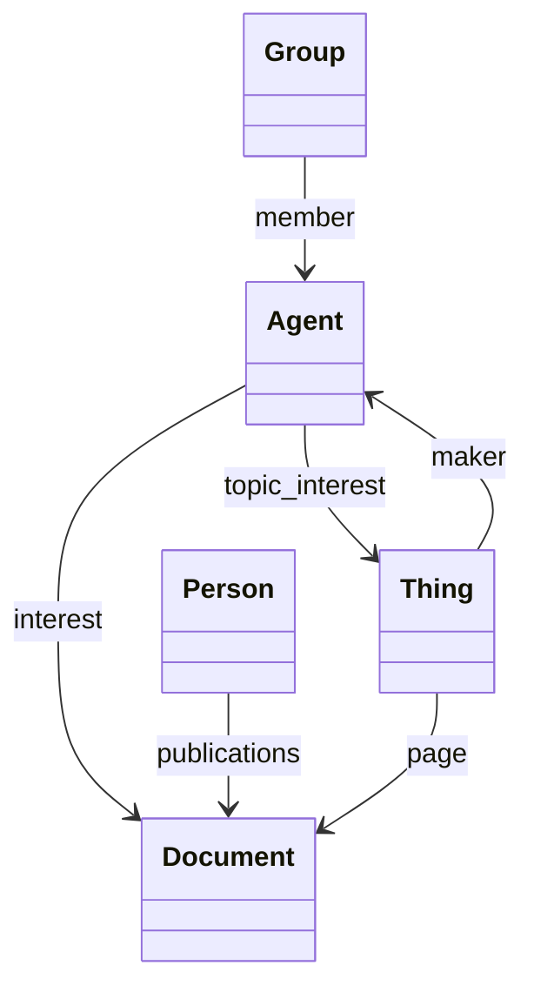

[](https://github.com/oeg-upm/morph-kgc/blob/main/LICENSE) 

# DeVoS
Depicting Vocabulary Summaries. It is a tool to generate a visual summary of the ontology. 


## Main Features
* Generate summary diagrams.
  * Allows the user to use the summarisation technique (e.g., using meta data, class frequency, or label length)
* Enrich ontologies with labels for the classes that are missing them.

## Tutorial

1. Use meta data as the signal for importance
```
python -m devos.gister -i data/ieswc/cocoon.ttl --freq
python -m devos.gister -i data/ieswc_enriched/ck.ttl -t -d -a  


python -m devos.gister -i data/ieswc_enriched/explanation-ontology.owl  -t -d -a --topn 7


python -m devos.gister -i data/ieswc_enriched/devops/core.ttl   --freq --topn 7

python -m devos.gister -i data/ieswc_enriched/devops/core.ttl   --freq --topn 7
```


**Example**:




## Experiment

### Preprocessing 
We perform ontology enrichment by adding labels from class names for the classes that do not
have labels.

#### IESWC (ISWC and ESWC)
```
python -m experiments.enrich -i data/ieswc/* -o data/ieswc_enriched
;
python -m experiments.enrich -i data/ieswc/devops/* -o data/ieswc_enriched/devops
```


### Run the experiment

#### From Ontology Meta data (OntMet)

* To only use `owl:ObjectProperty` when getting the relevant properties to the given meta

##### Top in Lov
```python -m experiments.generate_diagrams -i data/Top_in_lov/* -o output/Top_in_lov_object_property --object-property```

* To use all properties when getting the relevant properties to the given meta
```python -m experiments.generate_diagrams -i data/Top_in_lov/* -o output/Top_in_lov_any_property```


##### IESWC (ISWC and ESWC)
* Top 7 classes: ```python -m experiments.generate_diagrams -i data/ieswc_enriched/* -o output/ieswc_meta --object-property --topn 7```

```python -m experiments.generate_diagrams -i data/ieswc_enriched/devops/* -o output/ieswc_meta --object-property --topn 7```


* Top 7 classes 14 references: ```python -m experiments.generate_diagrams -i data/ieswc_enriched/* -o output/ieswc_meta --object-property --topn 7 --topr 14```


#### From Frequency

##### Top in Lov


* Top 5: ```python -m experiments.generate_diagrams -i data/Top_in_lov/* -o output/Top_in_lov_freq --object-property --freq --topn 5```

* Top 10: ```python -m experiments.generate_diagrams -i data/Top_in_lov/* -o output/Top_in_lov_freq --object-property --freq --topn 10```


##### IESWC (ISWC and ESWC)

* Top 7 classes: ```python -m experiments.generate_diagrams -i data/ieswc_enriched/* -o output/ieswc_freq --object-property --freq --topn 7```

 Top 7 classes from devops: ```python -m experiments.generate_diagrams -i data/ieswc_enriched/devops/* -o output/ieswc_freq --object-property --freq --topn 7```

* Top 7 classes and 14 relations: ```python -m experiments.generate_diagrams -i data/ieswc_enriched/* -o output/ieswc_freq --object-property --freq --topn 7 --topr 14```

* Top 10 classes: ```python -m experiments.generate_diagrams -i data/ieswc_enriched/* -o output/ieswc_freq --object-property --freq --topn 10```

[//]: # (* Top 10 classes and 10 relations: ```python -m experiments.generate_diagrams -i data/ieswc/* -o output/ieswc_freq --object-property --freq --topn 10 --topr 10```)


#### Label Length
##### IESWC (ISWC and ESWC)

* Top 7 classes: ```python -m experiments.generate_diagrams -i data/ieswc_enriched/* -o output/ieswc_leng --leng --topn 7```

Top 7 classes from devops: ```python -m experiments.generate_diagrams -i data/ieswc_enriched/devops/* -o output/ieswc_leng --leng --topn 7```

* Top 7 classes and 14 relations: ```python -m experiments.generate_diagrams -i data/ieswc_enriched/* -o output/ieswc_leng --leng --topn 7 --topr 14```


* Top 10: ```python -m experiments.generate_diagrams -i data/ieswc_enriched/* -o output/ieswc_leng --leng --topn 10```


### Generate Statistics
About the number of classes properties to `stats.csv`
```
python -m experiments.analytics
```

[//]: # (#### Convert the md diagrams to pngs)

[//]: # (##### Requirement)

[//]: # ()
[//]: # ([mermaid-cli]&#40;https://github.com/mermaid-js/mermaid-cli&#41;)

[//]: # ()
[//]: # (##### Generate the pngs)

[//]: # (```)

[//]: # (python -m experiments.convert_diagrams -i output/Top_in_lov_freq_5/*.md)

[//]: # (```)

[//]: # (*Note: the coverted does not look as good as the rendered mermaid diagrams*)


## Tests
To run unit tests
```
python -m unittest discover tests 
```

## Authors

- [Ahmad Alobaid](https://github.com/ahmad88me) - (Ontology Engineering Group - UPM)
- [Jhon Toledo](https://github.com/jatoledo) - (Ontology Engineering Group - UPM)
- [María Poveda Villalón] - (Ontology Engineering Group - UPM)
- [Oscar Corcho] - (Ontology Engineering Group - UPM)

*[Ontology Engineering Group](https://oeg.fi.upm.es/)*, *[Universidad Politécnica de Madrid](https://www.upm.es/internacional)*.

## License

Ontology-Gister is available under the permissive **[Apache License 2.0](https://github.com/oeg-upm/Morph-KGC/blob/main/LICENSE)**.
