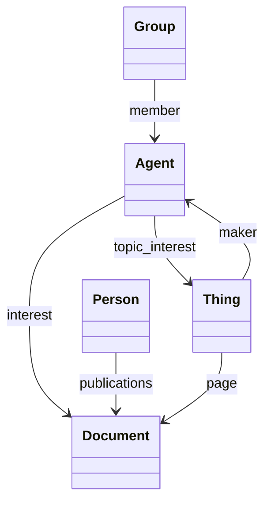
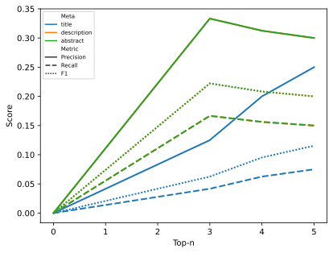
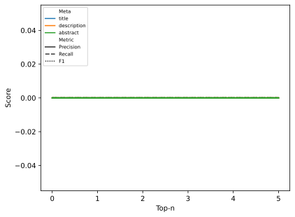

[](https://github.com/oeg-upm/morph-kgc/blob/main/LICENSE) 

# Ontology-Gister

A tool to generate a gist of the ontology


## Main Features

* In Progress

## Tutorial

* In Progress


**Example**:




## Experiment

### Run the experiment

#### From Meta data

* For DBpedia, we use `en` to speed up the process in taking into account only English labels. Note that it take sometime to generate the summary for DBpedia.
```python -m experiments.generate_diagrams -i data/Top_in_lov/dbpedia.owl -o output/Top_in_lov -l en```

* Then, the experiment is performed for the rest of ontologies. Note that it will not overwrite generated resources. 
```python -m experiments.generate_diagrams -i data/Top_in_lov/* -o output/Top_in_lov```

#### Only Frequency
Using only frequency

```
python -m experiments.generate_diagrams -i data/Top_in_lov/* -o output/Top_in_lov --freq
```

### Evaluation

#### META
```
python -m experiments.evaluation -i output/Top_in_lov/*meta*.json  -g data/gs_lov.csv -o output/Top_in_lov/results-meta.svg
```

#### Frequency
```
python -m experiments.evaluation -i output/Top_in_lov/*freq*.json  -g data/gs_lov.csv -o output/Top_in_lov/results-freq.svg
```


## Results





## Authors

- [Ahmad Alobaid](https://github.com/ahmad88me) - (Ontology Engineering Group - UPM)
- [Jhon Toledo](https://github.com/jatoledo) - (Ontology Engineering Group - UPM)

*[Ontology Engineering Group](https://oeg.fi.upm.es/)*, *[Universidad Politécnica de Madrid](https://www.upm.es/internacional)*.

## License

Ontology-Gister is available under the permissive **[Apache License 2.0](https://github.com/oeg-upm/Morph-KGC/blob/main/LICENSE)**.
