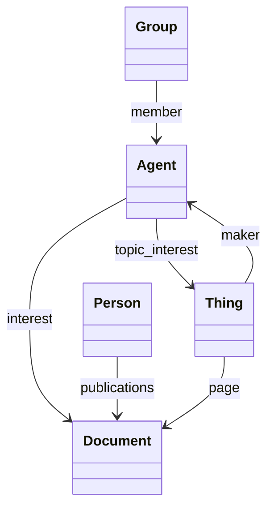

[](https://ahmad88me.semaphoreci.com/projects/Devos)
[](https://codecov.io/gh/oeg-upm/Devos)
[](https://github.com/oeg-upm/morph-kgc/blob/main/LICENSE) [](https://zenodo.org/record/7456085#.Y9vBhnZBzGI) 

# Devos
Depicting Vocabulary Summaries(**Devos**) is a tool that generates a visual summary from a given ontology. Devos is built on top of [Mermaid](https://mermaid.js.org/) syntax which is a Markdown-inspired tool that renders text in diagrams and it uses **[SPARQL](https://www.w3.org/TR/rdf-sparql-query/) Query Language** over the ontology generating a visual summary. It's based on three approaches.

1. OntMet. Uses Ontology Meta Data to find matching classes.
2. ClaFreq. Relies on Class Frequency in the ontology as the importance signal.
3. LabLen. Utilizes Label Length of the classes as the importance signal. The intuition is that importance classes have richer metadata than less important classes.


## Main Features
* Generate summary diagrams.
  * Allows the user to use the summarisation technique (e.g., using meta data, class frequency, or label length)
* Enrich ontologies with labels for the classes that are missing them.

## Dependencies
* [owl2diagram](https://github.com/jatoledo/owl2diagram)
* [requirements.txt](/requirements.txt)

## Install
```pip install devos-py```

# Usage
There are three main ways to use Devos. Web application, Python Library, and as a standalone application (CLI).

## Web Application
The web application is built using Flask. To run it, you can use the following command: ```python -m web.app```. This will start the server on `127.0.0.1:5000`. You can also pass the port as a parameter.


## As a library
  You have three main functions: `meta_workflow`, `freq_workflow`, and `leng_workflow`. The all expects the path to the ontology, the output path to the summary diagram, and the maximum number of classes `topn` (referred to it in paper as `k`).


## CLI Tutorial

```
usage: gister.py [-h] -i INPUT [-o OUTPUT] [-t] [-d] [-a] [-n TOPN] [-l LANG] [--object-property]
                 [-m MAXOPTIONS] [-f] [-g] [-r TOPR] [--soft] [--debug]

Get a Gist of the ontology

options:
  -h, --help            show this help message and exit
  -i INPUT, --input INPUT
                        Ontology file.
  -o OUTPUT, --output OUTPUT
                        Output file.
  -t, --title           To look into titles.
  -d, --description     To look into description.
  -a, --abstract        To look into abstract.
  -n TOPN, --topn TOPN  The maximum number of relevant classes.
  -l LANG, --lang LANG  language tag. e.g., en
  --object-property     Whether to only use object property for getting the relevant properties relenvant
                        to the given meta
  -m MAXOPTIONS, --maxoptions MAXOPTIONS
                        Maximum number of meta literal for each meta type (e.g., title)
  -f, --freq            Use frequency to fetch the most relevant classes and properties
  -g, --leng            Use the length to fetch the most relevant classes and properties
  -r TOPR, --topr TOPR  The maximum number of relations
  --soft                Also include classes related to the important classes
  --debug               To print debug information

```

There are three supported methods: OntMet, ClaFreq, and LabLen.

1. Use the metadata of the ontology (**OntMet** method). Use the options `-t -d -a`, which stands for *title*, *description*, and *abstract*, respectively.  

Examples:
```
python -m devos.gister -i data/ieswc_enriched/ck.ttl -t -d -a  


python -m devos.gister -i data/ieswc_enriched/explanation-ontology.owl  -t -d -a --topn 7
```
2. To use the class frequency method (**ClaFreq**), include `--freq` option. 

Examples:
```
python -m devos.gister -i data/ieswc_enriched/devops/core.ttl   --freq --topn 7

python -m devos.gister -i data/ieswc_enriched/devops/core.ttl   --freq --topn 7

python -m devos.gister -i data/ieswc/cocoon.ttl --freq
```

3. To use the length of the class label, **LabLen**, include the option `--leng`. 


**Diagram Example**:




## Experimentation

[Experiments](experiments/README.md)


## Tests
To run unit tests
```
python -m unittest discover tests 
```

## Authors

- [Ahmad Alobaid](https://github.com/ahmad88me) - (Ontology Engineering Group - UPM)
- [Jhon Toledo](https://github.com/jatoledo) - (Ontology Engineering Group - UPM)
- [María Poveda Villalón](https://github.com/mariapoveda) - (Ontology Engineering Group - UPM)
- [Oscar Corcho](https://github.com/ocorcho) - (Ontology Engineering Group - UPM)

*[Ontology Engineering Group](https://oeg.fi.upm.es/)*, *[Universidad Politécnica de Madrid](https://www.upm.es/internacional)*.

## License

DevoS is available under the permissive **[Apache License 2.0](https://github.com/oeg-upm/Devos/blob/main/LICENSE)**.

## PyPi
```
python -m build
twine check dist/*
twine upload dist/*
```

