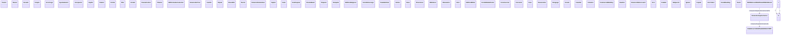

```mermaid
	classDiagram

    
    class Puente {
    
    }

    class Museo {
    
    }

    class Boveda {
    
    }

    class Templo {
    
    }

    class ArcoCiego {
    
    }

    class Ayuntamiento {
    
    }

    class Aeropuerto {
    
    }

    class Capilla {
    
    }

    class Palacio {
    
    }

    class Ermita {
    
    }

    class Pilar {
    
    }

    class Arcada {
    
    }

    class DovelaCentral {
    
    }

    class Pilastra {
    
    }

    class EdificioGubernamental {
    
    }

    class EstacionDeTren {
    
    }

    class Castillo {
    
    }

    class Enjuta {
    
    }

    class Bovedilla {
    
    }

    class Puerto {
    
    }

    class EstacionDeAutobus {
    
    }

    class Capitel {
    
    }

    class Fuste {
    
    }

    class SemiCupula {
    
    }

    class DovelaBasal {
    
    }

    class Timpano {
    
    }

    class Mezquita {
    
    }

    class EdificioReligioso {
    
    }

    class ArcoDeDescarga {
    
    }

    class ParadaDeTaxi {
    
    }

    class Vertice {
    
    }

    class Basa {
    
    }

    class Pinacoteca {
    
    }

    class Biblioteca {
    
    }

    class Monasterio {
    
    }

    class Hotel {
    
    }

    class EdificioMilitar {
    
    }

    class ArcoDeMedioPunto {
    
    }

    class Construccion {
    
    }

    class Convento {
    
    }

    class Casa {
    
    }

    class ElementoArquitectonico {
    
    }

    class Rascacielos {
    
    }

    class Sinagoga {
    
    }

    class Dovela {
    
    }

    class Catedral {
    
    }

    class Columna {
    
    }

    class CommercialBuilding {
    
    }

    class Basilica {
    
    }

    class EstacionDeFerrocarril {
    
    }

    class Arco {
    
    }

    class Establo {
    
    }

    class Helipuerto {
    
    }

    class Iglesia {
    
    }

    class Cupula {
    
    }

    class ArcoTudor {
    
    }

    class HoodMoulding {
    
    }

    class Teatro {
    
    }


ElementoArquitectonico  --> N3a622ca7c94043f5addd254fa77fdff7   :componeArquitectonicamente  

N303fb2cce40f44d7b4e40f9d0d15e1af  --> ElementoArquitectonico   :compuestoAquitectonicamentePor  


c  --> m   :o  

c  --> m   :o  

```