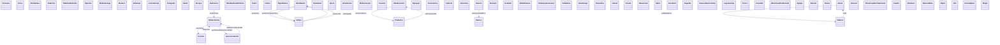

```mermaid
	classDiagram

    
    class Romance {
    
    }

    class Lirica {
    
    }

    class AltoRelieve {
    
    }

    class Didactica {
    
    }

    class DeBultoRedondo {
    
    }

    class Epistola {
    
    }

    class Mediometraje {
    
    }

    class Mosaico {
    
    }

    class Estampa {
    
    }

    class Cortometraje {
    
    }

    class Fotografia {
    
    }

    class Mural {
    
    }

    class Ensayo {
    
    }

    class ObraDeArte {
    
    }

    class ObraDeArteDePintura {
    
    }

    class Teatro {
    
    }

    class Critica {
    
    }

    class BajoRelieve {
    
    }

    class Ilustracion {
    
    }

    class Estatuaria {
    
    }

    class Opera {
    
    }

    class Ornamental {
    
    }

    class MedioCuerpo {
    
    }

    class Cancion {
    
    }

    class ObraEscenica {
    
    }

    class Epopeya {
    
    }

    class TresCuartos {
    
    }

    class Oratoria {
    
    }

    class Historieta {
    
    }

    class Musica {
    
    }

    class Zarzuela {
    
    }

    class Grabado {
    
    }

    class MedioRelieve {
    
    }

    class ObraArquitectonica {
    
    }

    class DeRelieve {
    
    }

    class VasoGriego {
    
    }

    class Dramatica {
    
    }

    class Fabula {
    
    }

    class Novela {
    
    }

    class Obravisual {
    
    }

    class Satira {
    
    }

    class Escultura {
    
    }

    class Tragedia {
    
    }

    class CatacumbaCristiana {
    
    }

    class ObraLiteraria {
    
    }

    class Largometraje {
    
    }

    class Fresco {
    
    }

    class Comedia {
    
    }

    class ObraVisualTradicional {
    
    }

    class Egloga {
    
    }

    class Retrato {
    
    }

    class Drama {
    
    }

    class Danza {
    
    }

    class Gravura {
    
    }

    class ObraVisualNoTradicional {
    
    }

    class Cuadro {
    
    }

    class Miniatura {
    
    }

    class RelevoMetal {
    
    }

    class Epica {
    
    }

    class Oda {
    
    }

    class PoemaEpico {
    
    }

    class Elegia {
    
    }


ObraDeArte  --> Artista   :tieneAutor  

ObraDeArte  --> Artista   :tieneParticipacionDe  

Artista  --> ObraDeArte   :esAutorDe  

Artista  --> ObraDeArte   :participaEn  

Ilustracion  --> ObraLiteraria   :ilustraTexto  

ObraEscenica  --> Productor   :tieneProductor  

Productor  --> ObraEscenica   :esProductorDe  

Musica  --> Musico   :esInterpretadaPor  

ObraLiteraria  --> Escritor   :escritoPor  

ObraLiteraria  --> GeneroLiterario   :perteneceAGeneroLiterario  

GeneroLiterario  --> ObraLiteraria   :esGeneroLiterarioDe  

Escritor  --> ObraLiteraria   :haEscrito  

Danza  --> Bailarin   :esBailadaPor  

Bailarin  --> Danza   :baila  

```