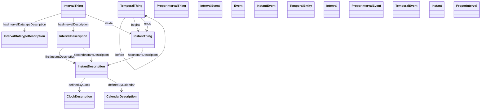

```mermaid
	classDiagram

    
    class IntervalThing {
    
    }

    class IntervalDatatypeDescription {
    
    }

    class TemporalThing {
    
    }

    class ProperIntervalThing {
    
    }

    class IntervalEvent {
    
    }

    class InstantDescription {
    
    }

    class InstantThing {
    
    }

    class Event {
    
    }

    class InstantEvent {
    
    }

    class TemporalEntity {
    
    }

    class Interval {
    
    }

    class ProperIntervalEvent {
    
    }

    class TemporalEvent {
    
    }

    class IntervalDescription {
    
    }

    class Instant {
    
    }

    class ProperInterval {
    
    }

    class IntervalThing {
    
    }

    class IntervalDatatypeDescription {
    
    }

    class TemporalThing {
    
    }

    class ClockDescription {
    
    }

    class CalendarDescription {
    
    }

    class InstantDescription {
    
    }

    class InstantThing {
    
    }

    class IntervalDescription {
    
    }


IntervalThing  --> IntervalDatatypeDescription   :hasIntervalDatatypeDescription  

IntervalThing  --> IntervalDescription   :hasIntervalDescription  

IntervalThing  --> InstantThing   :inside  

TemporalThing  --> TemporalThing   :before  

TemporalThing  --> InstantThing   :begins  

TemporalThing  --> InstantThing   :ends  

InstantDescription  --> ClockDescription   :definedByClock  

InstantDescription  --> CalendarDescription   :definedByCalendar  

IntervalDescription  --> InstantDescription   :firstInstantDescription  

InstantThing  --> InstantDescription   :hasInstantDescription  

IntervalDescription  --> InstantDescription   :secondInstantDescription  

```