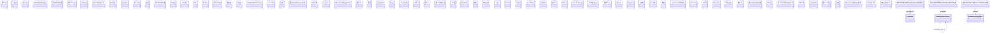

```mermaid
	classDiagram

    
    class Geiser {
    
    }

    class Agua {
    
    }

    class Cueva {
    
    }

    class CuendaDeDrenaje {
    
    }

    class DistritoPostal {
    
    }

    class Montanna {
    
    }

    class Cuenca {
    
    }

    class ZonaPantanosa {
    
    }

    class Parcela {
    
    }

    class Oceano {
    
    }

    class Vinnedo {
    
    }

    class Rio {
    
    }

    class CanalArtificial {
    
    }

    class Fenomeno {
    
    }

    class Presa {
    
    }

    class Embalse {
    
    }

    class Mar {
    
    }

    class Crater {
    
    }

    class Manantial {
    
    }

    class Tierra {
    
    }

    class Playa {
    
    }

    class CadenaMontannosa {
    
    }

    class Desierto {
    
    }

    class Valle {
    
    }

    class CarreteraConvencional {
    
    }

    class Ciudad {
    
    }

    class Laguna {
    
    }

    class FenomenoFisiografico {
    
    }

    class Tramo {
    
    }

    class Aire {
    
    }

    class Autopista {
    
    }

    class Lago {
    
    }

    class Vegetacion {
    
    }

    class LimiteAdministrativo {
    
    }

    class Colina {
    
    }

    class Oasis {
    
    }

    class MedioNatural {
    
    }

    class Duna {
    
    }

    class Provincia {
    
    }

    class Ria {
    
    }

    class Cascada {
    
    }

    class Istmo {
    
    }

    class Cabo {
    
    }

    class Cruce {
    
    }

    class Acantilado {
    
    }

    class Camino {
    
    }

    class Costa {
    
    }

    class Paso {
    
    }

    class FuenteTermal {
    
    }

    class Archipielago {
    
    }

    class ViaFerrea {
    
    }

    class Volcan {
    
    }

    class Llanura {
    
    }

    class FenomenoGeografico {
    
    }

    class Golfo {
    
    }

    class Arrecife {
    
    }

    class Pais {
    
    }

    class FenomenoArtificial {
    
    }

    class Autovia {
    
    }

    class Canal {
    
    }

    class Carretera {
    
    }

    class Bosque {
    
    }

    class Meseta {
    
    }

    class AccidenteNatural {
    
    }

    class Bahia {
    
    }

    class ComunidadAutonoma {
    
    }

    class Glaciar {
    
    }

    class Pasarela {
    
    }

    class Peninsula {
    
    }

    class Isla {
    
    }

    class FenomenoHidrografico {
    
    }

    class Continente {
    
    }

    class MasaDeHielo {
    
    }


N318d528babdf42aab7ea65c6de8389cf  --> Fenomeno   :passNearOf  

LimiteAdministrativo  --> LimiteAdministrativo   :hasGeo  

LimiteAdministrativo  --> LimiteAdministrativo   :hasGeoDirect  

LimiteAdministrativo  --> LimiteAdministrativo   :isPartOfGeo  

LimiteAdministrativo  --> LimiteAdministrativo   :isPartOfGeoDirect  

N2e1ad3630f5344e7b61da5a445a79b43  --> LimiteAdministrativo   :locatedIn  

Nde60b95f5a7a4198bd77a2941fceff01  --> FenomenoGeografico   :passBy  

```