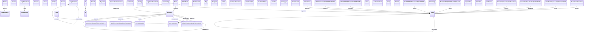

```mermaid
	classDiagram

    
    class ThesisDegree {
    
    }

    class Event {
    
    }

    class Journal {
    
    }

    class PersonalCommunicationDocument {
    
    }

    class Interview {
    
    }

    class Patent {
    
    }

    class Chapter {
    
    }

    class Statute {
    
    }

    class Na22cbb289279493f89942c915b6c3d90 {
    
    }

    class AudioVisualDocument {
    
    }

    class Manual {
    
    }

    class Magazine {
    
    }

    class PersonalCommunication {
    
    }

    class N25ab7f76c8164d8c81bb845fb39717aa {
    
    }

    class Periodical {
    
    }

    class Hearing {
    
    }

    class LegalCaseDocument {
    
    }

    class Proceedings {
    
    }

    class LegalDocument {
    
    }

    class Nde16f1a4fb2646af85aefa2311fb6cd7 {
    
    }

    class EditedBook {
    
    }

    class Document {
    
    }

    class Agent {
    
    }

    class BookSection {
    
    }

    class Map {
    
    }

    class Webpage {
    
    }

    class Article {
    
    }

    class CollectedDocument {
    
    }

    class DocumentPart {
    
    }

    class AcademicArticle {
    
    }

    class Standard {
    
    }

    class Newspaper {
    
    }

    class Specification {
    
    }

    class N11c093c98a794e4cb793e41396921781 {
    
    }

    class Performance {
    
    }

    class Note {
    
    }

    class Event {
    
    }

    class Thesis {
    
    }

    class Email {
    
    }

    class AudioDocument {
    
    }

    class Image {
    
    }

    class Website {
    
    }

    class N408ec48cd2394b2fbd8f431afeb1f072 {
    
    }

    class LegalDecision {
    
    }

    class Manuscript {
    
    }

    class Ncceb3df44b154dbe96a76b101c32a39f {
    
    }

    class Legislation {
    
    }

    class Collection {
    
    }

    class Conference {
    
    }

    class DocumentStatus {
    
    }

    class RDFSResource {
    
    }


Document  --> RDFSResource   :reviewOf  

AudioVisualDocument  --> Agent   :director  

LegalDecision  --> LegalDecision   :affirmedBy  

Agent  --> Agent   :interviewee  

LegalDecision  --> LegalDecision   :subsequentLegalDecision  

Ncbe9eea8dd314ea1be5d946d13e06024  --> Agent   :issuer  

Document  --> RDFSResource   :transcriptOf  

LegalDecision  --> LegalDecision   :reversedBy  

Note  --> RDFSResource   :annotates  

Event  --> Agent   :organizer  

Agent  --> Agent   :interviewer  

Thesis  --> ThesisDegree   :degree  

Document  --> Document   :cites  

Ncceb3df44b154dbe96a76b101c32a39f  --> Agent   :distributor  

PersonalCommunicationDocument  --> Agent   :recipient  

Document  --> Event   :presentedAt  

Document  --> Document   :reproducedIn  

Document  --> Nde16f1a4fb2646af85aefa2311fb6cd7   :contributorList  

Na22cbb289279493f89942c915b6c3d90  --> Agent   :editor  

LegalDocument  --> Organization   :court  

Nad2184292d0d4b448ae0609af29496d3  --> Agent   :owner  

Document  --> DocumentStatus   :status  

Document  --> N25ab7f76c8164d8c81bb845fb39717aa   :authorList  

N11c093c98a794e4cb793e41396921781  --> Agent   :translator  

Nbb5da8a5ea3c404abefdb0dc363f3f06  --> Agent   :producer  

Document  --> Document   :citedBy  

Event  --> Document   :presents  

Performance  --> Agent   :performer  

Document  --> Document   :translationOf  

Document  --> N408ec48cd2394b2fbd8f431afeb1f072   :editorList  

D  --> T   :C  

```