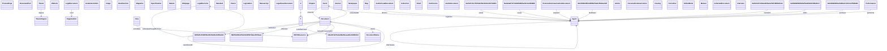

```mermaid
	classDiagram

    
    class Proceedings {
    
    }

    class DocumentPart {
    
    }

    class Agent {
    
    }

    class Thesis {
    
    }

    class Website {
    
    }

    class N2e227a074e2a48e29eeaa4bc2429b1b3 {
    
    }

    class Event {
    
    }

    class N62f41d04c2fb4c0e805d7b2ac4578aaa {
    
    }

    class AcademicArticle {
    
    }

    class Image {
    
    }

    class ThesisDegree {
    
    }

    class BookSection {
    
    }

    class Magazine {
    
    }

    class Specification {
    
    }

    class Statute {
    
    }

    class Note {
    
    }

    class Webpage {
    
    }

    class Document {
    
    }

    class AudioVisualDocument {
    
    }

    class Standard {
    
    }

    class Patent {
    
    }

    class DocumentStatus {
    
    }

    class Legislation {
    
    }

    class Manuscript {
    
    }

    class LegalCaseDocument {
    
    }

    class Performance {
    
    }

    class Chapter {
    
    }

    class RDFSResource {
    
    }

    class LegalDecision {
    
    }

    class Journal {
    
    }

    class Newspaper {
    
    }

    class Map {
    
    }

    class LegalDocument {
    
    }

    class Collection {
    
    }

    class Email {
    
    }

    class Conference {
    
    }

    class AudioDocument {
    
    }

    class Naf62883580b04ef5a46f4047d95af2c7 {
    
    }

    class Na513c0721b2a4325a2a7b87d6961b114 {
    
    }

    class N0cf29912f05c4f858270a0c5522ac6d7 {
    
    }

    class PersonalCommunicationDocument {
    
    }

    class Event {
    
    }

    class Article {
    
    }

    class PersonalCommunication {
    
    }

    class N26faf6c3326f46e38115a5bc0df0ed23 {
    
    }

    class Hearing {
    
    }

    class Periodical {
    
    }

    class EditedBook {
    
    }

    class Manual {
    
    }

    class CollectedDocument {
    
    }

    class Interview {
    
    }


LegalDecision  --> LegalDecision   :reversedBy  

LegalDocument  --> Organization   :court  

AudioVisualDocument  --> Agent   :director  

Na7027cbc757644c59c03cb2c83718404  --> Agent   :owner  

Nada4a07377e64db08b5a16c3a1058989  --> Agent   :issuer  

PersonalCommunicationDocument  --> Agent   :recipient  

LegalDecision  --> LegalDecision   :affirmedBy  

Document  --> Document   :cites  

Document  --> Document   :translationOf  

Document  --> N26faf6c3326f46e38115a5bc0df0ed23   :authorList  

Agent  --> Agent   :interviewer  

Document  --> N62f41d04c2fb4c0e805d7b2ac4578aaa   :editorList  

Event  --> Document   :presents  

N0cf29912f05c4f858270a0c5522ac6d7  --> Agent   :distributor  

Document  --> N2e227a074e2a48e29eeaa4bc2429b1b3   :contributorList  

Note  --> RDFSResource   :annotates  

Document  --> RDFSResource   :reviewOf  

Document  --> Document   :citedBy  

Document  --> RDFSResource   :transcriptOf  

Document  --> Document   :reproducedIn  

Na513c0721b2a4325a2a7b87d6961b114  --> Agent   :translator  

Agent  --> Agent   :interviewee  

LegalDecision  --> LegalDecision   :subsequentLegalDecision  

Naf62883580b04ef5a46f4047d95af2c7  --> Agent   :editor  

Na139b06655ed44b6a7c153c127589462  --> Agent   :producer  

Performance  --> Agent   :performer  

Event  --> Agent   :organizer  

Document  --> DocumentStatus   :status  

Document  --> Event   :presentedAt  

Thesis  --> ThesisDegree   :degree  

D  --> T   :C  

```