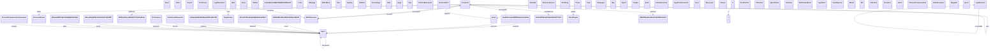

```mermaid
	classDiagram

    
    class AudioVisualDocument {
    
    }

    class Email {
    
    }

    class Patent {
    
    }

    class Journal {
    
    }

    class Conference {
    
    }

    class DocumentStatus {
    
    }

    class Thesis {
    
    }

    class Document {
    
    }

    class N6f9bd860f48144218f5a3984c3448631 {
    
    }

    class Series {
    
    }

    class Event {
    
    }

    class Statute {
    
    }

    class Nadadd31e0ad448708dd8dc08f69adeff {
    
    }

    class N8335a12b2cc94966af76f74efb2d1dce {
    
    }

    class Letter {
    
    }

    class Webpage {
    
    }

    class N0f7eb7921eb844a0b88625e3be86097f {
    
    }

    class EditedBook {
    
    }

    class Brief {
    
    }

    class Hearing {
    
    }

    class Website {
    
    }

    class Proceedings {
    
    }

    class Slide {
    
    }

    class Image {
    
    }

    class Film {
    
    }

    class CollectedDocument {
    
    }

    class DocumentPart {
    
    }

    class Note {
    
    }

    class Performance {
    
    }

    class Standard {
    
    }

    class N51ee058c680943cb94166c27340048f7 {
    
    }

    class Event {
    
    }

    class ReferenceSource {
    
    }

    class Workshop {
    
    }

    class Organization {
    
    }

    class Agent {
    
    }

    class N405a44dd34b942d8a6a33801d60378f0 {
    
    }

    class LegalDocument {
    
    }

    class N0bceb688270b4a749a8fa86f054336e6 {
    
    }

    class Code {
    
    }

    class Newspaper {
    
    }

    class Map {
    
    }

    class Report {
    
    }

    class Chapter {
    
    }

    class Book {
    
    }

    class AcademicArticle {
    
    }

    class LegalCaseDocument {
    
    }

    class RDFSResource {
    
    }

    class Nee8061a3c6c545ffbf05a3da71e640bb {
    
    }

    class Issue {
    
    }

    class Manuscript {
    
    }

    class Excerpt {
    
    }

    class LegalDecision {
    
    }

    class BookSection {
    
    }

    class Slideshow {
    
    }

    class Specification {
    
    }

    class Interview {
    
    }

    class MultiVolumeBook {
    
    }

    class PersonalCommunicationDocument {
    
    }

    class Legislation {
    
    }

    class CourtReporter {
    
    }

    class Manual {
    
    }

    class Bill {
    
    }

    class Collection {
    
    }

    class N7b4e22ff053e4f7b8e293b067f779670 {
    
    }

    class Periodical {
    
    }

    class Article {
    
    }

    class PersonalCommunication {
    
    }

    class AudioDocument {
    
    }

    class ThesisDegree {
    
    }

    class N38df09ba663a451e91597988c0516f78 {
    
    }

    class Magazine {
    
    }

    class Quote {
    
    }


Document  --> RDFSResource   :reviewOf  

LegalDecision  --> LegalDecision   :affirmedBy  

Document  --> Document   :translationOf  

Thesis  --> ThesisDegree   :degree  

LegalDocument  --> Organization   :court  

Nee8061a3c6c545ffbf05a3da71e640bb  --> Agent   :translator  

Event  --> Agent   :organizer  

Agent  --> Agent   :interviewer  

N6f9bd860f48144218f5a3984c3448631  --> Agent   :issuer  

Document  --> RDFSResource   :transcriptOf  

Document  --> Document   :citedBy  

Document  --> DocumentStatus   :status  

N0f7eb7921eb844a0b88625e3be86097f  --> Agent   :distributor  

N405a44dd34b942d8a6a33801d60378f0  --> Agent   :producer  

Document  --> Document   :reproducedIn  

LegalDecision  --> LegalDecision   :subsequentLegalDecision  

Document  --> Event   :presentedAt  

AudioVisualDocument  --> Agent   :director  

Performance  --> Agent   :performer  

Agent  --> Agent   :interviewee  

Document  --> N7b4e22ff053e4f7b8e293b067f779670   :contributorList  

N51ee058c680943cb94166c27340048f7  --> Agent   :owner  

N0bceb688270b4a749a8fa86f054336e6  --> Agent   :editor  

LegalDecision  --> LegalDecision   :reversedBy  

Document  --> Document   :cites  

Document  --> N8335a12b2cc94966af76f74efb2d1dce   :authorList  

PersonalCommunicationDocument  --> Agent   :recipient  

Event  --> Document   :presents  

Note  --> RDFSResource   :annotates  

Document  --> N38df09ba663a451e91597988c0516f78   :editorList  


D  --> T   :C  

```