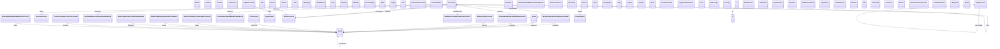

```mermaid
	classDiagram

    
    class AudioVisualDocument {
    
    }

    class Email {
    
    }

    class Patent {
    
    }

    class Journal {
    
    }

    class Conference {
    
    }

    class DocumentStatus {
    
    }

    class Thesis {
    
    }

    class Document {
    
    }

    class Event {
    
    }

    class Series {
    
    }

    class Statute {
    
    }

    class Letter {
    
    }

    class Webpage {
    
    }

    class EditedBook {
    
    }

    class Na54adad554ec42a0ae6063e3fbd4b0c6 {
    
    }

    class Brief {
    
    }

    class Hearing {
    
    }

    class Website {
    
    }

    class Proceedings {
    
    }

    class Slide {
    
    }

    class Image {
    
    }

    class Film {
    
    }

    class CollectedDocument {
    
    }

    class DocumentPart {
    
    }

    class Note {
    
    }

    class Performance {
    
    }

    class Standard {
    
    }

    class N92b153faa8214b7aa05328fd9d4bd5a2 {
    
    }

    class Nde8f79d260df4c56a0038d8713daafa8 {
    
    }

    class N1fae13cfa6a34f909ca7fd6ce934a16f {
    
    }

    class Event {
    
    }

    class ReferenceSource {
    
    }

    class Workshop {
    
    }

    class Nf36af43e50fa46328694b10ad439cce4 {
    
    }

    class N9623c5313be5471dbbd248117f5bcad5 {
    
    }

    class Organization {
    
    }

    class Agent {
    
    }

    class LegalDocument {
    
    }

    class Code {
    
    }

    class Newspaper {
    
    }

    class Map {
    
    }

    class Report {
    
    }

    class Chapter {
    
    }

    class Book {
    
    }

    class AcademicArticle {
    
    }

    class LegalCaseDocument {
    
    }

    class RDFSResource {
    
    }

    class Issue {
    
    }

    class Manuscript {
    
    }

    class Excerpt {
    
    }

    class LegalDecision {
    
    }

    class N82656d6175094bcf988e11e33d7652ff {
    
    }

    class BookSection {
    
    }

    class Slideshow {
    
    }

    class Specification {
    
    }

    class Interview {
    
    }

    class Nb024a2d91ba84b11898db87ba3742e71 {
    
    }

    class MultiVolumeBook {
    
    }

    class PersonalCommunicationDocument {
    
    }

    class Legislation {
    
    }

    class CourtReporter {
    
    }

    class Manual {
    
    }

    class Bill {
    
    }

    class Collection {
    
    }

    class Nfc4a98606d6345e18a268629e51dcfb8 {
    
    }

    class N6460e8c3da7941c2a4a5feeaf9391b58 {
    
    }

    class Periodical {
    
    }

    class Article {
    
    }

    class PersonalCommunication {
    
    }

    class AudioDocument {
    
    }

    class ThesisDegree {
    
    }

    class Magazine {
    
    }

    class Quote {
    
    }


N6460e8c3da7941c2a4a5feeaf9391b58  --> Agent   :translator  

Document  --> RDFSResource   :reviewOf  

LegalDecision  --> LegalDecision   :affirmedBy  

Document  --> Document   :translationOf  

Thesis  --> ThesisDegree   :degree  

LegalDocument  --> Organization   :court  

Event  --> Agent   :organizer  

Document  --> Nf36af43e50fa46328694b10ad439cce4   :editorList  

Nfc4a98606d6345e18a268629e51dcfb8  --> Agent   :producer  

Agent  --> Agent   :interviewer  

Document  --> RDFSResource   :transcriptOf  

Document  --> Document   :citedBy  

Document  --> DocumentStatus   :status  

Document  --> Document   :reproducedIn  

LegalDecision  --> LegalDecision   :subsequentLegalDecision  

Document  --> Event   :presentedAt  

Document  --> N82656d6175094bcf988e11e33d7652ff   :contributorList  

AudioVisualDocument  --> Agent   :director  

Performance  --> Agent   :performer  

Agent  --> Agent   :interviewee  

N9623c5313be5471dbbd248117f5bcad5  --> Agent   :owner  

Nde8f79d260df4c56a0038d8713daafa8  --> Agent   :issuer  

LegalDecision  --> LegalDecision   :reversedBy  

Document  --> Document   :cites  

N92b153faa8214b7aa05328fd9d4bd5a2  --> Agent   :distributor  

PersonalCommunicationDocument  --> Agent   :recipient  

Event  --> Document   :presents  

Note  --> RDFSResource   :annotates  

Nb024a2d91ba84b11898db87ba3742e71  --> Agent   :editor  

Document  --> Na54adad554ec42a0ae6063e3fbd4b0c6   :authorList  


D  --> T   :C  

```