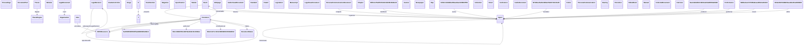

```mermaid
	classDiagram

    
    class Proceedings {
    
    }

    class DocumentPart {
    
    }

    class Na7802f346f154fffaa844803bfe282c2 {
    
    }

    class Thesis {
    
    }

    class Agent {
    
    }

    class Website {
    
    }

    class Event {
    
    }

    class N7329eeffa20e438ba764227c63c19ef9 {
    
    }

    class AcademicArticle {
    
    }

    class Image {
    
    }

    class ThesisDegree {
    
    }

    class Nff0c1e75a5f747b49c3db3f0c8944e34 {
    
    }

    class N41e7e37cc1014c9993990347284d4fe0 {
    
    }

    class BookSection {
    
    }

    class Magazine {
    
    }

    class Specification {
    
    }

    class Statute {
    
    }

    class N24a129376d684f2eae6de29ca8546900 {
    
    }

    class N6cc43846796c42979a4344c03c199dec {
    
    }

    class Webpage {
    
    }

    class Note {
    
    }

    class Document {
    
    }

    class AudioVisualDocument {
    
    }

    class Standard {
    
    }

    class Patent {
    
    }

    class DocumentStatus {
    
    }

    class Legislation {
    
    }

    class Manuscript {
    
    }

    class LegalCaseDocument {
    
    }

    class Performance {
    
    }

    class Chapter {
    
    }

    class RDFSResource {
    
    }

    class LegalDecision {
    
    }

    class Journal {
    
    }

    class Newspaper {
    
    }

    class Map {
    
    }

    class LegalDocument {
    
    }

    class Collection {
    
    }

    class Email {
    
    }

    class Conference {
    
    }

    class AudioDocument {
    
    }

    class PersonalCommunicationDocument {
    
    }

    class Event {
    
    }

    class Article {
    
    }

    class PersonalCommunication {
    
    }

    class Hearing {
    
    }

    class Periodical {
    
    }

    class EditedBook {
    
    }

    class Manual {
    
    }

    class CollectedDocument {
    
    }

    class Interview {
    
    }


Thesis  --> ThesisDegree   :degree  

LegalDecision  --> LegalDecision   :reversedBy  

LegalDocument  --> Organization   :court  

AudioVisualDocument  --> Agent   :director  

PersonalCommunicationDocument  --> Agent   :recipient  

Nff0c1e75a5f747b49c3db3f0c8944e34  --> Agent   :distributor  

LegalDecision  --> LegalDecision   :affirmedBy  

Document  --> Document   :cites  

Document  --> Document   :translationOf  

Document  --> Na7802f346f154fffaa844803bfe282c2   :editorList  

Agent  --> Agent   :interviewer  

Event  --> Document   :presents  

Nd72ccb18ddbe456aa44ae136f6847f53  --> Agent   :owner  

N7329eeffa20e438ba764227c63c19ef9  --> Agent   :translator  

Document  --> RDFSResource   :reviewOf  

Document  --> Document   :citedBy  

Document  --> RDFSResource   :transcriptOf  

Nae1deb4d02c34841a12ba09593a92d42  --> Agent   :producer  

Document  --> Document   :reproducedIn  

Document  --> N6cc43846796c42979a4344c03c199dec   :authorList  

Agent  --> Agent   :interviewee  

Document  --> N41e7e37cc1014c9993990347284d4fe0   :contributorList  

LegalDecision  --> LegalDecision   :subsequentLegalDecision  

Performance  --> Agent   :performer  

N86feebacfc97459a8eae28612a16d1c9  --> Agent   :issuer  

Event  --> Agent   :organizer  

Document  --> DocumentStatus   :status  

Document  --> Event   :presentedAt  

N24a129376d684f2eae6de29ca8546900  --> Agent   :editor  

Note  --> RDFSResource   :annotates  

D  --> T   :C  

```