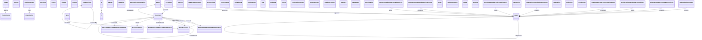

```mermaid
	classDiagram

    
    class ThesisDegree {
    
    }

    class Event {
    
    }

    class Journal {
    
    }

    class PersonalCommunicationDocument {
    
    }

    class Interview {
    
    }

    class Patent {
    
    }

    class Chapter {
    
    }

    class Statute {
    
    }

    class AudioVisualDocument {
    
    }

    class N1bc285880474494f9b54a1cb9ab1785e {
    
    }

    class Manual {
    
    }

    class Magazine {
    
    }

    class PersonalCommunication {
    
    }

    class Na1af1f8a95f44e53b8d45a04c6cdf6ff {
    
    }

    class N98ba73aaac1647768187656ffbaea184 {
    
    }

    class Periodical {
    
    }

    class Hearing {
    
    }

    class LegalCaseDocument {
    
    }

    class Nd12a187268ec46738f2b37ce9a0b2dd1 {
    
    }

    class Proceedings {
    
    }

    class LegalDocument {
    
    }

    class EditedBook {
    
    }

    class Document {
    
    }

    class N4815eb2aa192411b8755f26698fad2a5 {
    
    }

    class BookSection {
    
    }

    class Agent {
    
    }

    class Map {
    
    }

    class Webpage {
    
    }

    class Article {
    
    }

    class CollectedDocument {
    
    }

    class DocumentPart {
    
    }

    class AcademicArticle {
    
    }

    class Standard {
    
    }

    class Newspaper {
    
    }

    class Specification {
    
    }

    class Performance {
    
    }

    class Note {
    
    }

    class Event {
    
    }

    class Thesis {
    
    }

    class Email {
    
    }

    class AudioDocument {
    
    }

    class Image {
    
    }

    class Website {
    
    }

    class LegalDecision {
    
    }

    class Manuscript {
    
    }

    class N637595952eb04ffea07814edba4d70f1 {
    
    }

    class Legislation {
    
    }

    class Collection {
    
    }

    class Conference {
    
    }

    class DocumentStatus {
    
    }

    class RDFSResource {
    
    }


Document  --> RDFSResource   :reviewOf  

Document  --> Na1af1f8a95f44e53b8d45a04c6cdf6ff   :editorList  

AudioVisualDocument  --> Agent   :director  

LegalDecision  --> LegalDecision   :affirmedBy  

Agent  --> Agent   :interviewee  

Nf650a89be8e047839998a583634fc31b  --> Agent   :producer  

LegalDecision  --> LegalDecision   :subsequentLegalDecision  

N0afd075eb9ea4eda9f5925084cf5b841  --> Agent   :issuer  

Document  --> RDFSResource   :transcriptOf  

LegalDecision  --> LegalDecision   :reversedBy  

Note  --> RDFSResource   :annotates  

Event  --> Agent   :organizer  

Agent  --> Agent   :interviewer  

Thesis  --> ThesisDegree   :degree  

Document  --> Document   :cites  

N98ba73aaac1647768187656ffbaea184  --> Agent   :distributor  

PersonalCommunicationDocument  --> Agent   :recipient  

Document  --> Event   :presentedAt  

Document  --> Document   :reproducedIn  

LegalDocument  --> Organization   :court  

Nb70de3335a8f44179bb358d5fa13f27b  --> Agent   :owner  

N1bc285880474494f9b54a1cb9ab1785e  --> Agent   :translator  

N637595952eb04ffea07814edba4d70f1  --> Agent   :editor  

Document  --> N4815eb2aa192411b8755f26698fad2a5   :contributorList  

Document  --> DocumentStatus   :status  

Document  --> Nd12a187268ec46738f2b37ce9a0b2dd1   :authorList  

Document  --> Document   :citedBy  

Event  --> Document   :presents  

Performance  --> Agent   :performer  

Document  --> Document   :translationOf  

D  --> T   :C  

```