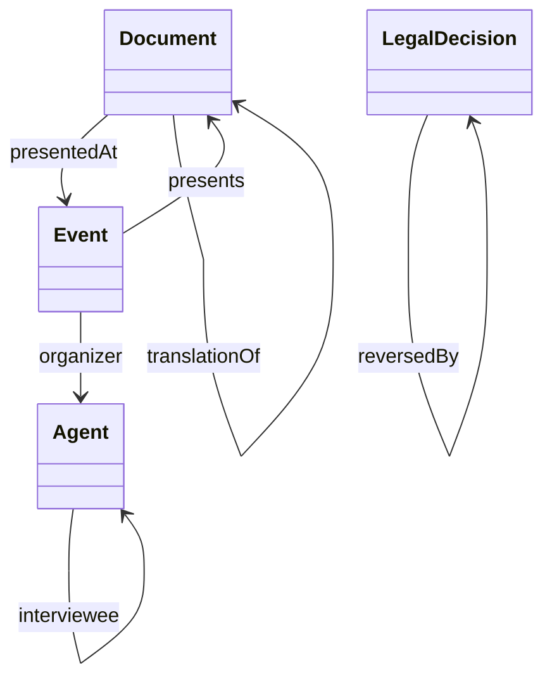

```mermaid
	classDiagram

    
    class Document {
    
    }

    class Agent {
    
    }

    class LegalDecision {
    
    }

    class Event {
    
    }


Event  --> Agent   :organizer  

LegalDecision  --> LegalDecision   :subsequentLegalDecision  

Document  --> Event   :presentedAt  

Document  --> Document   :cites  

Agent  --> Agent   :interviewer  

Document  --> Document   :citedBy  

Agent  --> Agent   :interviewee  

LegalDecision  --> LegalDecision   :affirmedBy  

LegalDecision  --> LegalDecision   :reversedBy  

Event  --> Document   :presents  

Document  --> Document   :reproducedIn  

Document  --> Document   :translationOf  

```