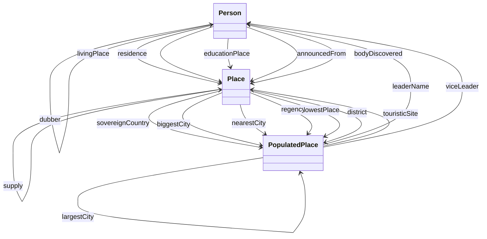

```mermaid
	classDiagram

    
    class Person {
    
    }

    class Place {
    
    }

    class PopulatedPlace {
    
    }


Place  --> Place   :northEastPlace  

Place  --> Place   :locatedInArea  

PopulatedPlace  --> PopulatedPlace   :sheading  

PopulatedPlace  --> Person   :leaderName  

Person  --> Person   :usurper  

Person  --> Place   :livingPlace  

PopulatedPlace  --> PopulatedPlace   :borough  

Person  --> Person   :spouse  

Place  --> Place   :northPlace  

Place  --> Place   :mainIsland  

Person  --> Place   :residence  

PopulatedPlace  --> PopulatedPlace   :oldProvince  

Person  --> Person   :collaboration  

Person  --> Place   :educationPlace  

Place  --> Place   :closeTo  

Person  --> Person   :parent  

PopulatedPlace  --> PopulatedPlace   :arrondissement  

Person  --> Place   :announcedFrom  

Place  --> Place   :southWestPlace  

Place  --> PopulatedPlace   :sovereignCountry  

Person  --> Place   :bodyDiscovered  

Person  --> Person   :friend  

Place  --> PopulatedPlace   :biggestCity  

Person  --> Person   :seiyu  

Place  --> Place   :endPoint  

Place  --> Place   :hasOutsidePlace  

PopulatedPlace  --> PopulatedPlace   :oldDistrict  

Person  --> Person   :student  

Place  --> Place   :westPlace  

Person  --> Person   :opponent  

Person  --> Person   :child  

Place  --> Place   :land  

Person  --> Person   :cousurper  

Person  --> Person   :detractor  

PopulatedPlace  --> PopulatedPlace   :ceremonialCounty  

Place  --> PopulatedPlace   :nearestCity  

Place  --> PopulatedPlace   :regency  

Place  --> PopulatedPlace   :lowestPlace  

PopulatedPlace  --> PopulatedPlace   :principalArea  

PopulatedPlace  --> Place   :touristicSite  

PopulatedPlace  --> Person   :viceLeader  

Person  --> Person   :sibling  

Person  --> Person   :relation  

Place  --> Place   :nextEntity  

PopulatedPlace  --> PopulatedPlace   :largestSettlement  

Place  --> Place   :subregion  

PopulatedPlace  --> PopulatedPlace   :neighboringMunicipality  

Place  --> Place   :previousEntity  

Person  --> Person   :colleague  

Person  --> Person   :relative  

Person  --> Person   :copilote  

PopulatedPlace  --> PopulatedPlace   :lieutenancyArea  

Person  --> Person   :dubber  

Place  --> Place   :hasInsidePlace  

Place  --> Place   :northWestPlace  

Place  --> PopulatedPlace   :district  

Place  --> Place   :eastPlace  

Place  --> Place   :southEastPlace  

PopulatedPlace  --> PopulatedPlace   :largestCity  

Place  --> Place   :supply  


```