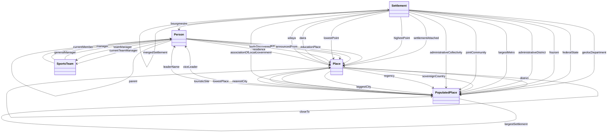

```mermaid
	classDiagram

    
    class Person {
    
    }

    class Place {
    
    }

    class PopulatedPlace {
    
    }

    class Settlement {
    
    }

    class SportsTeam {
    
    }


PopulatedPlace  --> PopulatedPlace   :sheading  

Person  --> Person   :relative  

Place  --> Place   :mainIsland  

Place  --> Place   :endPoint  

Person  --> Person   :collaboration  

Settlement  --> Settlement   :canton  

Person  --> Person   :relation  

Place  --> Place   :locatedInArea  

Person  --> SportsTeam   :currentTeamManager  

Settlement  --> Place   :settlementAttached  

Person  --> Person   :seiyu  

Person  --> Person   :copilote  

PopulatedPlace  --> Place   :touristicSite  

Settlement  --> Settlement   :twinTown  

Place  --> Place   :hasOutsidePlace  

PopulatedPlace  --> PopulatedPlace   :oldDistrict  

SportsTeam  --> Person   :generalManager  

Settlement  --> Person   :bourgmestre  

SportsTeam  --> Person   :manager  

Settlement  --> PopulatedPlace   :geolocDepartment  

Place  --> PopulatedPlace   :district  

Settlement  --> Settlement   :adjacentSettlement  

Settlement  --> Place   :highestPoint  

Person  --> Person   :detractor  

PopulatedPlace  --> PopulatedPlace   :largestCity  

Person  --> Person   :friend  

Person  --> Person   :colleague  

Place  --> Place   :supply  

Place  --> Place   :northPlace  

Person  --> Person   :dubber  

Settlement  --> PopulatedPlace   :federalState  

Settlement  --> PopulatedPlace   :frazioni  

Place  --> Place   :land  

PopulatedPlace  --> PopulatedPlace   :borough  

Place  --> Place   :eastPlace  

Person  --> Person   :spouse  

Person  --> Person   :child  

Place  --> Place   :subregion  

Place  --> Place   :southWestPlace  

Person  --> Person   :usurper  

Place  --> Place   :northWestPlace  

Settlement  --> PopulatedPlace   :administrativeDistrict  

Settlement  --> PopulatedPlace   :largestMetro  

Place  --> Place   :previousEntity  

Person  --> Place   :educationPlace  

Person  --> Place   :announcedFrom  

Place  --> PopulatedPlace   :sovereignCountry  

Place  --> Place   :southEastPlace  

PopulatedPlace  --> Person   :viceLeader  

Person  --> Person   :sibling  

PopulatedPlace  --> PopulatedPlace   :principalArea  

Place  --> Place   :northEastPlace  

Person  --> Place   :livingPlace  

PopulatedPlace  --> Person   :leaderName  

PopulatedPlace  --> PopulatedPlace   :neighboringMunicipality  

SportsTeam  --> Person   :currentMember  

Settlement  --> PopulatedPlace   :jointCommunity  

Settlement  --> Place   :lowestPoint  

Settlement  --> PopulatedPlace   :administrativeCollectivity  

Place  --> Place   :nextEntity  

Person  --> Person   :student  

Settlement  --> Settlement   :mergedSettlement  

Person  --> Place   :bodyDiscovered  

Place  --> Place   :hasInsidePlace  

Settlement  --> Place   :daira  

PopulatedPlace  --> PopulatedPlace   :lieutenancyArea  

Place  --> PopulatedPlace   :regency  

Place  --> PopulatedPlace   :biggestCity  

Settlement  --> PopulatedPlace   :associationOfLocalGovernment  

PopulatedPlace  --> PopulatedPlace   :arrondissement  

Settlement  --> Place   :wilaya  

Person  --> Person   :cousurper  

Person  --> Person   :opponent  

Place  --> PopulatedPlace   :nearestCity  

Place  --> Place   :westPlace  

Place  --> PopulatedPlace   :lowestPlace  

Person  --> SportsTeam   :teamManager  

PopulatedPlace  --> PopulatedPlace   :oldProvince  

PopulatedPlace  --> PopulatedPlace   :ceremonialCounty  

Place  --> Place   :closeTo  

PopulatedPlace  --> PopulatedPlace   :largestSettlement  

Person  --> Person   :parent  

Person  --> Place   :residence  

```