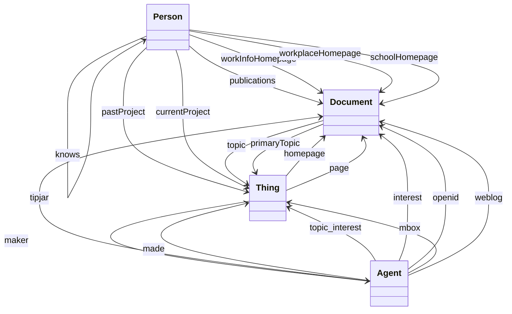

```mermaid
	classDiagram

    
    class Document {
    
    }

    class Thing {
    
    }

    class Agent {
    
    }

    class Person {
    
    }


Person  --> Person   :knows  

Person  --> Thing   :pastProject  

Person  --> Document   :publications  

Agent  --> Document   :tipjar  

Person  --> Thing   :currentProject  

Agent  --> Thing   :made  

Document  --> Thing   :topic  

Person  --> Document   :workInfoHomepage  

Document  --> Thing   :primaryTopic  

Agent  --> Thing   :topic_interest  

Thing  --> Agent   :maker  

Agent  --> Document   :interest  

Agent  --> Document   :openid  

Thing  --> Document   :homepage  

Agent  --> Thing   :mbox  

Agent  --> Document   :weblog  

Person  --> Document   :workplaceHomepage  

Person  --> Document   :schoolHomepage  

Thing  --> Document   :page  

```