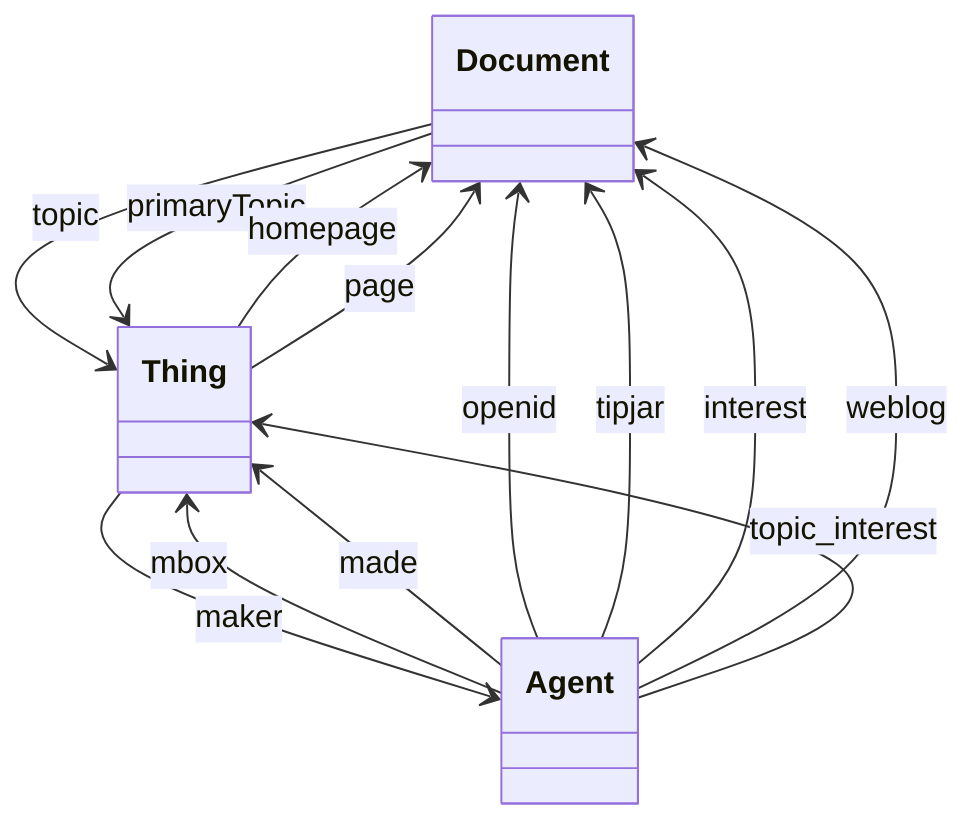

```mermaid
	classDiagram

    
    class Document {
    
    }

    class Thing {
    
    }

    class Agent {
    
    }


Document  --> Thing   :topic  

Document  --> Thing   :primaryTopic  

Agent  --> Thing   :mbox  

Thing  --> Agent   :maker  

Agent  --> Thing   :made  

Agent  --> Document   :openid  

Thing  --> Document   :homepage  

Thing  --> Document   :page  

Agent  --> Document   :tipjar  

Agent  --> Document   :interest  

Agent  --> Document   :weblog  

Agent  --> Thing   :topic_interest  

```