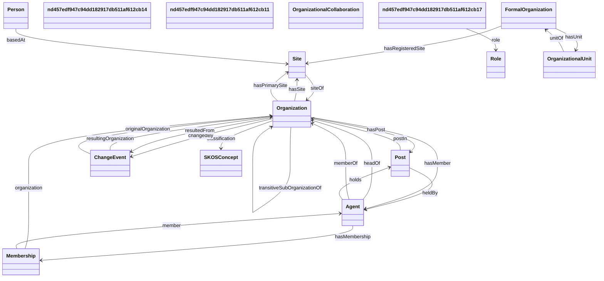

```mermaid
	classDiagram

    
    class Site {
    
    }

    class FormalOrganization {
    
    }

    class nd457edf947c94dd182917db511af612cb14 {
    
    }

    class Organization {
    
    }

    class nd457edf947c94dd182917db511af612cb11 {
    
    }

    class Post {
    
    }

    class Role {
    
    }

    class OrganizationalCollaboration {
    
    }

    class ChangeEvent {
    
    }

    class OrganizationalUnit {
    
    }

    class Membership {
    
    }

    class nd457edf947c94dd182917db511af612cb17 {
    
    }


nd457edf947c94dd182917db511af612cb17  --> Role   :role  

Organization  --> SKOSConcept   :classification  

Membership  --> Organization   :organization  

FormalOrganization  --> Site   :hasRegisteredSite  

ChangeEvent  --> Organization   :resultingOrganization  

Agent  --> Organization   :headOf  

OrganizationalUnit  --> FormalOrganization   :unitOf  

Membership  --> Agent   :member  

Agent  --> Organization   :memberOf  

Agent  --> Membership   :hasMembership  

Organization  --> ChangeEvent   :changedBy  

Person  --> Site   :basedAt  

Organization  --> Post   :hasPost  

ChangeEvent  --> Organization   :originalOrganization  

Organization  --> Organization   :linkedTo  

Organization  --> ChangeEvent   :resultedFrom  

Organization  --> Site   :hasSite  

Organization  --> Site   :hasPrimarySite  

Organization  --> Organization   :hasSubOrganization  

Site  --> Organization   :siteOf  

Post  --> Agent   :heldBy  

Organization  --> Organization   :subOrganizationOf  

FormalOrganization  --> OrganizationalUnit   :hasUnit  

Organization  --> Agent   :hasMember  

Agent  --> Post   :holds  

Organization  --> Organization   :transitiveSubOrganizationOf  

Post  --> Organization   :postIn  

```