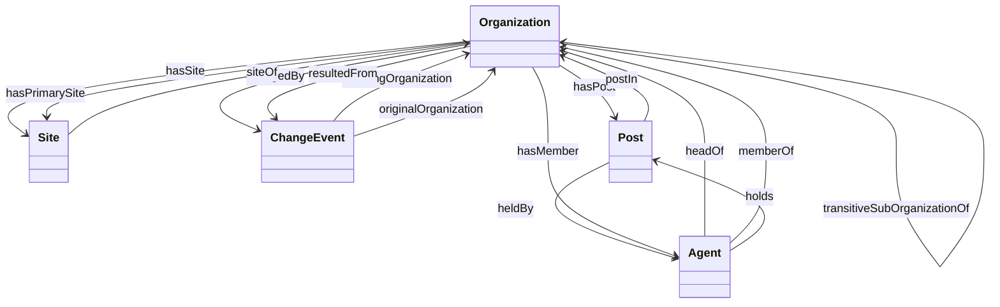

```mermaid
	classDiagram

    
    class Organization {
    
    }

    class Agent {
    
    }

    class Site {
    
    }

    class ChangeEvent {
    
    }

    class Post {
    
    }


ChangeEvent  --> Organization   :resultingOrganization  

Agent  --> Organization   :headOf  

Agent  --> Organization   :memberOf  

Organization  --> ChangeEvent   :changedBy  

Organization  --> Post   :hasPost  

ChangeEvent  --> Organization   :originalOrganization  

Organization  --> Organization   :linkedTo  

Organization  --> ChangeEvent   :resultedFrom  

Organization  --> Site   :hasSite  

Organization  --> Site   :hasPrimarySite  

Organization  --> Organization   :hasSubOrganization  

Site  --> Organization   :siteOf  

Post  --> Agent   :heldBy  

Organization  --> Organization   :subOrganizationOf  

Organization  --> Agent   :hasMember  

Agent  --> Post   :holds  

Organization  --> Organization   :transitiveSubOrganizationOf  

Post  --> Organization   :postIn  

```