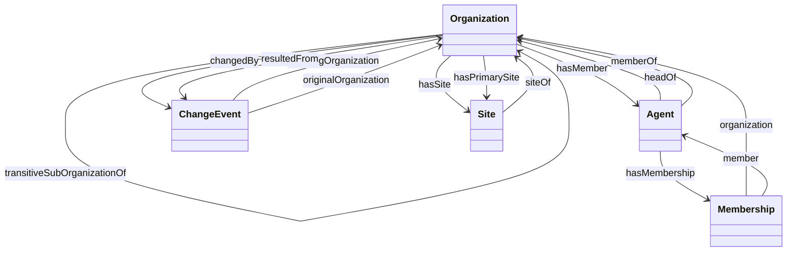

```mermaid
	classDiagram

    
    class Organization {
    
    }

    class Agent {
    
    }

    class ChangeEvent {
    
    }

    class Site {
    
    }

    class Membership {
    
    }


Membership  --> Organization   :organization  

ChangeEvent  --> Organization   :resultingOrganization  

Agent  --> Organization   :headOf  

Membership  --> Agent   :member  

Agent  --> Organization   :memberOf  

Agent  --> Membership   :hasMembership  

Organization  --> ChangeEvent   :changedBy  

ChangeEvent  --> Organization   :originalOrganization  

Organization  --> Organization   :linkedTo  

Organization  --> ChangeEvent   :resultedFrom  

Organization  --> Site   :hasSite  

Site  --> Organization   :siteOf  

Organization  --> Organization   :hasSubOrganization  

Organization  --> Site   :hasPrimarySite  

Organization  --> Organization   :subOrganizationOf  

Organization  --> Agent   :hasMember  

Organization  --> Organization   :transitiveSubOrganizationOf  

```