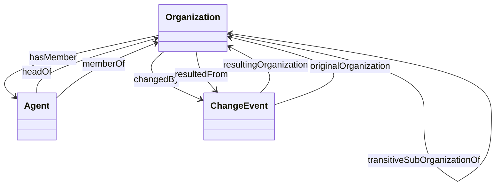

```mermaid
	classDiagram

    
    class Organization {
    
    }

    class Agent {
    
    }

    class ChangeEvent {
    
    }


ChangeEvent  --> Organization   :resultingOrganization  

Agent  --> Organization   :headOf  

Agent  --> Organization   :memberOf  

Organization  --> ChangeEvent   :changedBy  

ChangeEvent  --> Organization   :originalOrganization  

Organization  --> Organization   :linkedTo  

Organization  --> ChangeEvent   :resultedFrom  

Organization  --> Organization   :hasSubOrganization  

Organization  --> Organization   :subOrganizationOf  

Organization  --> Agent   :hasMember  

Organization  --> Organization   :transitiveSubOrganizationOf  

```