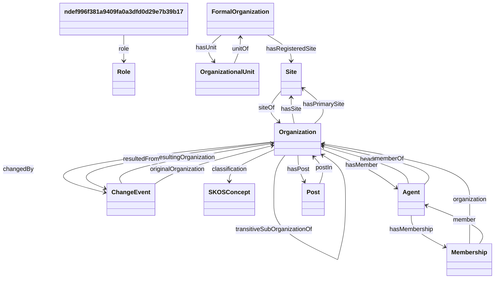

```mermaid
	classDiagram

    
    class ndef996f381a9409fa0a3dfd0d29e7b39b17 {
    
    }

    class FormalOrganization {
    
    }

    class Organization {
    
    }

    class Role {
    
    }

    class ChangeEvent {
    
    }

    class OrganizationalUnit {
    
    }

    class Membership {
    
    }


ndef996f381a9409fa0a3dfd0d29e7b39b17  --> Role   :role  

Organization  --> SKOSConcept   :classification  

Membership  --> Organization   :organization  

FormalOrganization  --> Site   :hasRegisteredSite  

ChangeEvent  --> Organization   :resultingOrganization  

Agent  --> Organization   :headOf  

OrganizationalUnit  --> FormalOrganization   :unitOf  

Membership  --> Agent   :member  

Agent  --> Organization   :memberOf  

Agent  --> Membership   :hasMembership  

Organization  --> ChangeEvent   :changedBy  

Organization  --> Post   :hasPost  

ChangeEvent  --> Organization   :originalOrganization  

Organization  --> Organization   :linkedTo  

Organization  --> ChangeEvent   :resultedFrom  

Organization  --> Site   :hasSite  

Site  --> Organization   :siteOf  

Organization  --> Organization   :hasSubOrganization  

Organization  --> Site   :hasPrimarySite  

Organization  --> Organization   :subOrganizationOf  

FormalOrganization  --> OrganizationalUnit   :hasUnit  

Organization  --> Agent   :hasMember  

Organization  --> Organization   :transitiveSubOrganizationOf  

Post  --> Organization   :postIn  

```