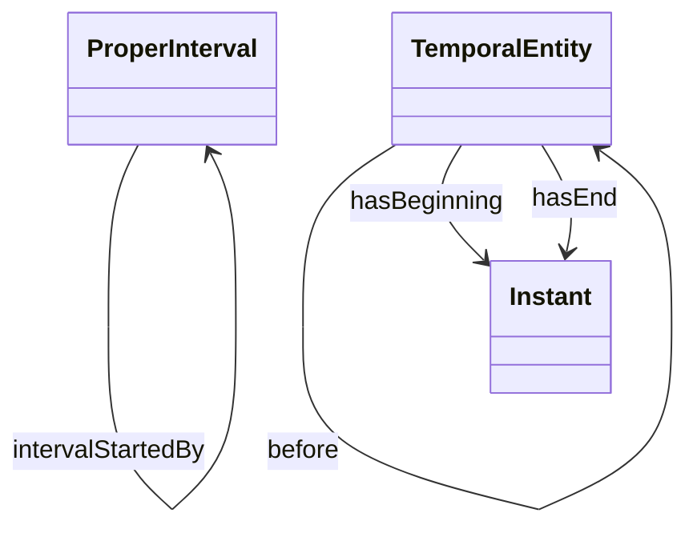

```mermaid
	classDiagram

    
    class ProperInterval {
    
    }

    class TemporalEntity {
    
    }

    class Instant {
    
    }


ProperInterval  --> ProperInterval   :intervalIn  

ProperInterval  --> ProperInterval   :intervalDuring  

ProperInterval  --> ProperInterval   :intervalContains  

ProperInterval  --> ProperInterval   :intervalMetBy  

ProperInterval  --> ProperInterval   :intervalMeets  

ProperInterval  --> ProperInterval   :intervalFinishedBy  

ProperInterval  --> ProperInterval   :intervalAfter  

TemporalEntity  --> TemporalEntity   :after  

ProperInterval  --> ProperInterval   :intervalOverlappedBy  

ProperInterval  --> ProperInterval   :intervalEquals  

ProperInterval  --> ProperInterval   :intervalBefore  

ProperInterval  --> ProperInterval   :intervalOverlaps  

ProperInterval  --> ProperInterval   :intervalStarts  

ProperInterval  --> ProperInterval   :intervalFinishes  

TemporalEntity  --> Instant   :hasBeginning  

TemporalEntity  --> TemporalEntity   :before  

ProperInterval  --> ProperInterval   :intervalDisjoint  

TemporalEntity  --> Instant   :hasEnd  

ProperInterval  --> ProperInterval   :intervalStartedBy  

```