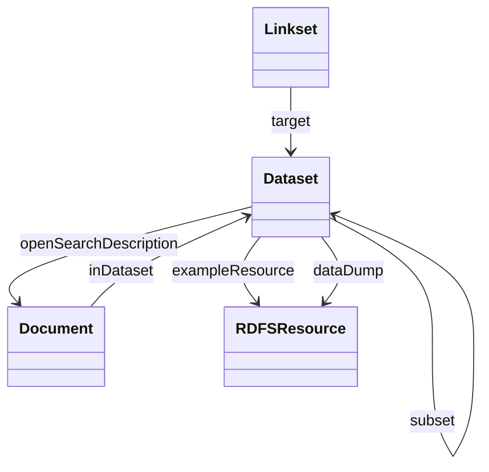

```mermaid
	classDiagram

    
    class Dataset {
    
    }

    class Linkset {
    
    }

    class Document {
    
    }

    class RDFSResource {
    
    }


Dataset  --> RDFSResource   :exampleResource  

Dataset  --> RDFSResource   :dataDump  

Dataset  --> Dataset   :classPartition  

Dataset  --> Document   :openSearchDescription  

Document  --> Dataset   :inDataset  

Dataset  --> Dataset   :propertyPartition  

Linkset  --> Dataset   :target  

Dataset  --> Dataset   :subset  

```