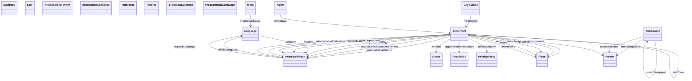

```mermaid
	classDiagram

    
    class Database {
    
    }

    class Law {
    
    }

    class HistoricalSettlement {
    
    }

    class InformationAppliance {
    
    }

    class Newspaper {
    
    }

    class Reference {
    
    }

    class Referee {
    
    }

    class Language {
    
    }

    class Settlement {
    
    }

    class BiologicalDatabase {
    
    }

    class ProgrammingLanguage {
    
    }


Settlement  --> PopulatedPlace   :administrativeDistrict  

Settlement  --> Settlement   :canton  

Settlement  --> PopulatedPlace   :associationOfLocalGovernment  

PopulatedPlace  --> Language   :officialLanguage  

Settlement  --> Group   :minority  

Settlement  --> PopulatedPlace   :jointCommunity  

Settlement  --> Population   :agglomerationPopulation  

Work  --> Language   :originalLanguage  

Settlement  --> PopulatedPlace   :largestMetro  

Settlement  --> PoliticalParty   :politicalMajority  

Language  --> PopulatedPlace   :spokenIn  

Settlement  --> Place   :daira  

Settlement  --> PopulatedPlace   :geolocDepartment  

Newspaper  --> Person   :managingEditor  

Newspaper  --> Newspaper   :sisterNewspaper  

Settlement  --> Settlement   :adjacentSettlement  

Settlement  --> Settlement   :mergedSettlement  

Legislature  --> Settlement   :meetingCity  

Newspaper  --> Person   :associateEditor  

Settlement  --> Place   :highestPoint  

PopulatedPlace  --> Language   :regionalLanguage  

Settlement  --> PopulatedPlace   :federalState  

Settlement  --> Person   :bourgmestre  

Settlement  --> Place   :settlementAttached  

Settlement  --> PopulatedPlace   :administrativeCollectivity  

Settlement  --> Place   :wilaya  

Settlement  --> Place   :lowestPoint  

Settlement  --> PopulatedPlace   :frazioni  

Agent  --> Settlement   :hometown  

Settlement  --> Settlement   :twinTown  

```