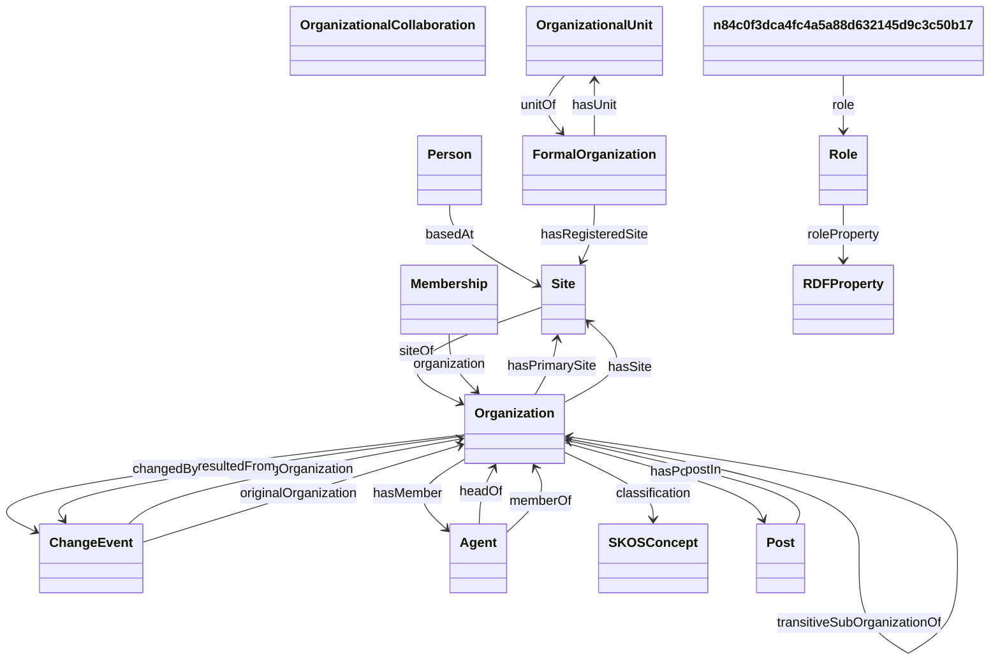

```mermaid
	classDiagram

    
    class Site {
    
    }

    class OrganizationalCollaboration {
    
    }

    class Role {
    
    }

    class OrganizationalUnit {
    
    }

    class Organization {
    
    }

    class ChangeEvent {
    
    }

    class FormalOrganization {
    
    }


ChangeEvent  --> Organization   :resultingOrganization  

Organization  --> Agent   :hasMember  

Person  --> Site   :basedAt  

ChangeEvent  --> Organization   :originalOrganization  

Organization  --> Organization   :subOrganizationOf  

Site  --> Organization   :siteOf  

Organization  --> SKOSConcept   :classification  

Organization  --> Post   :hasPost  

Organization  --> ChangeEvent   :changedBy  

Post  --> Organization   :postIn  

Agent  --> Organization   :headOf  

Membership  --> Organization   :organization  

Organization  --> Organization   :hasSubOrganization  

OrganizationalUnit  --> FormalOrganization   :unitOf  

Organization  --> Organization   :linkedTo  

Organization  --> Organization   :transitiveSubOrganizationOf  

Role  --> RDFProperty   :roleProperty  

FormalOrganization  --> OrganizationalUnit   :hasUnit  

Agent  --> Organization   :memberOf  

FormalOrganization  --> Site   :hasRegisteredSite  

n84c0f3dca4fc4a5a88d632145d9c3c50b17  --> Role   :role  

Organization  --> ChangeEvent   :resultedFrom  

Organization  --> Site   :hasPrimarySite  

Organization  --> Site   :hasSite  

```