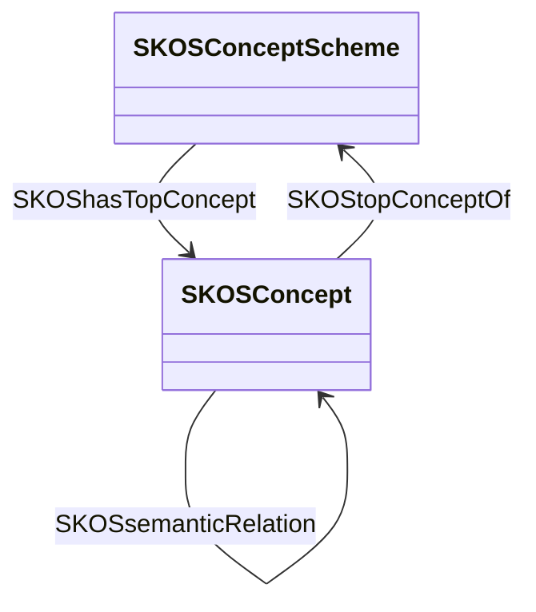

```mermaid
	classDiagram

    
    class SKOSConceptScheme {
    
    }

    class SKOSConcept {
    
    }


SKOSConcept  --> SKOSConcept   :SKOSsemanticRelation  

SKOSConceptScheme  --> SKOSConcept   :SKOShasTopConcept  

SKOSConcept  --> SKOSConceptScheme   :SKOStopConceptOf  

```