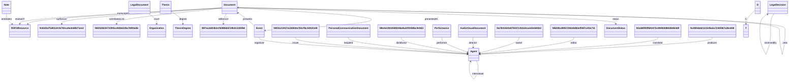

```mermaid
	classDiagram

    
    class Agent {
    
    }

    class Document {
    
    }

    class LegalDecision {
    
    }

    class RDFSResource {
    
    }

    class N42d3a7fa901241b783ca9a3e68b71ee2 {
    
    }

    class N82528225733f45ce92b6325a769f4a5b {
    
    }

    class Organization {
    
    }

    class ThesisDegree {
    
    }

    class N97acdd03b3cf4288bb57ef6411105fb8 {
    
    }

    class Event {
    
    }


Nc900de62121545a5a7245f467a36c659  --> Agent   :producer  

LegalDecision  --> LegalDecision   :affirmedBy  

Document  --> Document   :citedBy  

LegalDecision  --> LegalDecision   :subsequentLegalDecision  

N1e68f95ff683475c8909208602b863d9  --> Agent   :translator  

N8d49cd9057284e9d82eff487cef2e711  --> Agent   :editor  

Document  --> N97acdd03b3cf4288bb57ef6411105fb8   :editorList  

LegalDecision  --> LegalDecision   :reversedBy  

Document  --> RDFSResource   :transcriptOf  

Document  --> Document   :reproducedIn  

Agent  --> Agent   :interviewee  

Na7841024e978437c91164caed2eb840d  --> Agent   :owner  

Agent  --> Agent   :interviewer  

Document  --> Document   :translationOf  

AudioVisualDocument  --> Agent   :director  

Thesis  --> ThesisDegree   :degree  

Performance  --> Agent   :performer  

LegalDocument  --> Organization   :court  

Document  --> RDFSResource   :reviewOf  

Event  --> Document   :presents  

N9e4e19043590446a9a22f2458bc9e9d3  --> Agent   :distributor  

Document  --> DocumentStatus   :status  

Note  --> RDFSResource   :annotates  

PersonalCommunicationDocument  --> Agent   :recipient  

N934c21917ec04830a753cf9c419101d8  --> Agent   :issuer  

Document  --> Event   :presentedAt  

Document  --> N82528225733f45ce92b6325a769f4a5b   :contributorList  

Event  --> Agent   :organizer  

Document  --> N42d3a7fa901241b783ca9a3e68b71ee2   :authorList  

Document  --> Document   :cites  

D  --> T   :C  

```