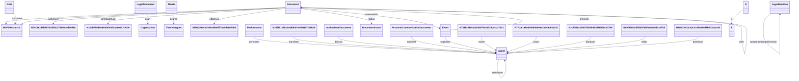

```mermaid
	classDiagram

    
    class Agent {
    
    }

    class Document {
    
    }

    class LegalDecision {
    
    }

    class RDFSResource {
    
    }

    class N74c16289b5874c55bc07d196b9d40566 {
    
    }

    class N1bcb789d2e9e404f8472ab800c7c81fe {
    
    }

    class Organization {
    
    }

    class ThesisDegree {
    
    }

    class N9b6258e4e0364a5b85f77ba0de9672b3 {
    
    }

    class Event {
    
    }


Performance  --> Agent   :performer  

Document  --> Document   :translationOf  

N347f312983ba465bb7e4fb615f7e98a5  --> Agent   :translator  

Document  --> DocumentStatus   :status  

Document  --> Document   :reproducedIn  

Event  --> Document   :presents  

Document  --> Event   :presentedAt  

Document  --> Document   :citedBy  

AudioVisualDocument  --> Agent   :director  

PersonalCommunicationDocument  --> Agent   :recipient  

Event  --> Agent   :organizer  

Document  --> N1bcb789d2e9e404f8472ab800c7c81fe   :contributorList  

Document  --> RDFSResource   :transcriptOf  

N701bc960ba434d079c43725be1c27e21  --> Agent   :owner  

LegalDecision  --> LegalDecision   :reversedBy  

N7fcc6198e439485e99aa1b44dd611d2f  --> Agent   :issuer  

LegalDecision  --> LegalDecision   :affirmedBy  

Document  --> Document   :cites  

LegalDocument  --> Organization   :court  

N2d5511a393674fb4b483d98b20c23789  --> Agent   :producer  

Nb0f935414f554b7d8fbe5b19da1ef7af  --> Agent   :editor  

LegalDecision  --> LegalDecision   :subsequentLegalDecision  

Note  --> RDFSResource   :annotates  

Agent  --> Agent   :interviewee  

Document  --> N9b6258e4e0364a5b85f77ba0de9672b3   :editorList  

Document  --> N74c16289b5874c55bc07d196b9d40566   :authorList  

Thesis  --> ThesisDegree   :degree  

N7d6c70c3cd2c42269a64d8b0f1baac45  --> Agent   :distributor  

Document  --> RDFSResource   :reviewOf  

Agent  --> Agent   :interviewer  

D  --> T   :C  

```