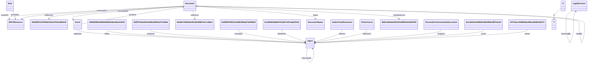

```mermaid
	classDiagram

    
    class Agent {
    
    }

    class Document {
    
    }

    class LegalDecision {
    
    }

    class RDFSResource {
    
    }

    class N3320551107884ab1914e7616cd9f3c5f {
    
    }


Document  --> RDFSResource   :reviewOf  

Event  --> Agent   :organizer  

N4b983804a5894bb086136a160a4c9152  --> Agent   :editor  

LegalDecision  --> LegalDecision   :subsequentLegalDecision  

LegalDecision  --> LegalDecision   :affirmedBy  

Document  --> Document   :translationOf  

Note  --> RDFSResource   :annotates  

N2ff3754a42244c60be4954fe27c53d5a  --> Agent   :producer  

Event  --> Document   :presents  

LegalDecision  --> LegalDecision   :reversedBy  

Agent  --> Agent   :interviewer  

Document  --> Neb8117820dbe4913be658b7be7ca00ee   :editorList  

Nefb8fb780511418db40fda672e099e0f  --> Agent   :translator  

Nc16f06efd4bb475cb817e87a6ab3f104  --> Agent   :distributor  

Document  --> DocumentStatus   :status  

Document  --> Document   :cites  

AudioVisualDocument  --> Agent   :director  

Performance  --> Agent   :performer  

Document  --> N29e1a83a6c8641f3a499f21de2d40782   :contributorList  

Document  --> N3320551107884ab1914e7616cd9f3c5f   :authorList  

Document  --> Event   :presentedAt  

PersonalCommunicationDocument  --> Agent   :recipient  

Document  --> Document   :reproducedIn  

Agent  --> Agent   :interviewee  

Nc1a6644142584bfc8b29818c887e5c9d  --> Agent   :issuer  

N727daccf038848ae9f6acd8db445ef71  --> Agent   :owner  

Document  --> Document   :citedBy  

Document  --> RDFSResource   :transcriptOf  

D  --> T   :C  

```