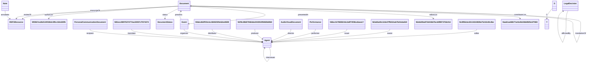

```mermaid
	classDiagram

    
    class Agent {
    
    }

    class Document {
    
    }

    class LegalDecision {
    
    }

    class RDFSResource {
    
    }

    class Nf30b7ea3b2134f43b3c5f0cc52e320fb {
    
    }


Document  --> Nf30b7ea3b2134f43b3c5f0cc52e320fb   :authorList  

Nc9f65cbc02134310839a75cfcb40c4be  --> Agent   :editor  

LegalDecision  --> LegalDecision   :subsequentLegalDecision  

Document  --> RDFSResource   :reviewOf  

N2ab5a40c12de47ffb531ab7b24eba524  --> Agent   :owner  

Agent  --> Agent   :interviewee  

Document  --> Document   :reproducedIn  

Document  --> DocumentStatus   :status  

N6bccfe79659244c2a9f74f38ca5aea17  --> Agent   :issuer  

Document  --> Event   :presentedAt  

Agent  --> Agent   :interviewer  

LegalDecision  --> LegalDecision   :reversedBy  

Performance  --> Agent   :performer  

Event  --> Document   :presents  

AudioVisualDocument  --> Agent   :director  

N1f9c48b879464da1943910f8482b6960  --> Agent   :producer  

Nfa6cdb3ff19c4cc584025f4e62ee0659  --> Agent   :distributor  

LegalDecision  --> LegalDecision   :affirmedBy  

Document  --> RDFSResource   :transcriptOf  

Event  --> Agent   :organizer  

Note  --> RDFSResource   :annotates  

Document  --> Document   :citedBy  

Document  --> Document   :cites  

N81ecc98975374774ac04fd7c7f474374  --> Agent   :translator  

Document  --> N2e6d0ba972d44b67bc4df897370dcfc6   :editorList  

Document  --> Document   :translationOf  

PersonalCommunicationDocument  --> Agent   :recipient  

Document  --> Naa61ae68b77a44e4b10bb8925c67f383   :contributorList  

D  --> T   :C  

```