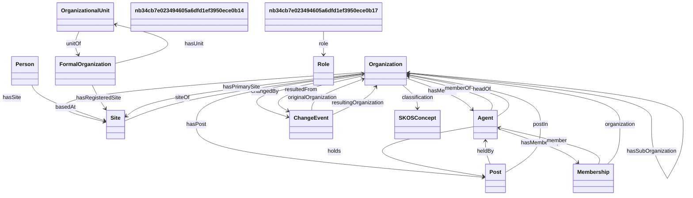

```mermaid
	classDiagram

    
    class Organization {
    
    }

    class Site {
    
    }

    class Agent {
    
    }

    class ChangeEvent {
    
    }

    class Post {
    
    }

    class OrganizationalUnit {
    
    }

    class FormalOrganization {
    
    }

    class SKOSConcept {
    
    }

    class nb34cb7e023494605a6dfd1ef3950ece0b14 {
    
    }

    class Role {
    
    }


Organization  --> Agent   :hasMember  

Organization  --> Site   :hasSite  

Organization  --> Organization   :subOrganizationOf  

Post  --> Agent   :heldBy  

OrganizationalUnit  --> FormalOrganization   :unitOf  

Organization  --> Organization   :transitiveSubOrganizationOf  

Organization  --> SKOSConcept   :classification  

Post  --> Organization   :postIn  

Organization  --> Post   :hasPost  

Agent  --> Organization   :memberOf  

Person  --> Site   :basedAt  

Agent  --> Post   :holds  

FormalOrganization  --> OrganizationalUnit   :hasUnit  

nb34cb7e023494605a6dfd1ef3950ece0b17  --> Role   :role  

Agent  --> Organization   :headOf  

ChangeEvent  --> Organization   :originalOrganization  

Site  --> Organization   :siteOf  

FormalOrganization  --> Site   :hasRegisteredSite  

Agent  --> Membership   :hasMembership  

Organization  --> Organization   :linkedTo  

Organization  --> ChangeEvent   :changedBy  

ChangeEvent  --> Organization   :resultingOrganization  

Organization  --> Organization   :hasSubOrganization  

Organization  --> ChangeEvent   :resultedFrom  

Organization  --> Site   :hasPrimarySite  

Membership  --> Agent   :member  

Membership  --> Organization   :organization  

```