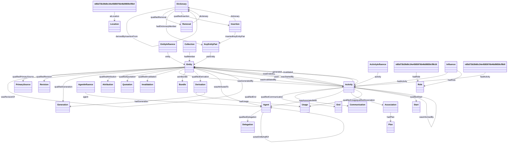

```mermaid
	classDiagram

    
    class Entity {
    
    }

    class Activity {
    
    }

    class Agent {
    
    }

    class Dictionary {
    
    }

    class Generation {
    
    }

    class Usage {
    
    }

    class KeyEntityPair {
    
    }

    class Location {
    
    }

    class Plan {
    
    }

    class Role {
    
    }


Activity  --> End   :qualifiedEnd  

Dictionary  --> Dictionary   :derivedByRemovalFrom  

Entity  --> Entity   :mentionOf  

KeyEntityPair  --> Entity   :pairEntity  

ActivityInfluence  --> Activity   :activity  

Removal  --> Dictionary   :dictionary  

Dictionary  --> Removal   :qualifiedRemoval  

Agent  --> Delegation   :qualifiedDelegation  

Activity  --> Communication   :qualifiedCommunication  

Insertion  --> KeyEntityPair   :insertedKeyEntityPair  

Entity  --> PrimarySource   :qualifiedPrimarySource  

Entity  --> Revision   :qualifiedRevision  

Entity  --> Generation   :qualifiedGeneration  

AgentInfluence  --> Agent   :agent  

Agent  --> Agent   :actedOnBehalfOf  

Derivation  --> Usage   :hadUsage  

Derivation  --> Generation   :hadGeneration  

n85d73b39d0c34e4585976b46d9859cf9b16  --> Role   :hadRole  

Activity  --> Entity   :used  

Entity  --> Attribution   :qualifiedAttribution  

Activity  --> Agent   :wasAssociatedWith  

Activity  --> Entity   :wasStartedBy  

Activity  --> Association   :qualifiedAssociation  

Entity  --> Quotation   :qualifiedQuotation  

Entity  --> Entity   :wasQuotedFrom  

Entity  --> Invalidation   :qualifiedInvalidation  

Entity  --> Activity   :wasGeneratedBy  

Influence  --> Activity   :hadActivity  

Dictionary  --> Dictionary   :derivedByInsertionFrom  

Insertion  --> Dictionary   :dictionary  

Influence  --> Role   :hadRole  

Activity  --> Entity   :wasEndedBy  

n85d73b39d0c34e4585976b46d9859cf9b9  --> Activity   :hadActivity  

Activity  --> Entity   :generated  

Entity  --> Entity   :hadPrimarySource  

Entity  --> Entity   :alternateOf  

Entity  --> Bundle   :asInBundle  

Entity  --> Derivation   :qualifiedDerivation  

n85d73b39d0c34e4585976b46d9859cf9b4  --> Location   :atLocation  

Entity  --> Entity   :specializationOf  

Entity  --> Entity   :wasDerivedFrom  

Dictionary  --> KeyEntityPair   :hadDictionaryMember  

Activity  --> Usage   :qualifiedUsage  

Activity  --> Entity   :invalidated  

EntityInfluence  --> Entity   :entity  

Entity  --> Agent   :wasAttributedTo  

Entity  --> Activity   :wasInvalidatedBy  

Entity  --> Entity   :wasRevisionOf  

Association  --> Plan   :hadPlan  

Dictionary  --> Insertion   :qualifiedInsertion  

Activity  --> Start   :qualifiedStart  

Collection  --> Entity   :hadMember  

Activity  --> Activity   :wasInformedBy  

```