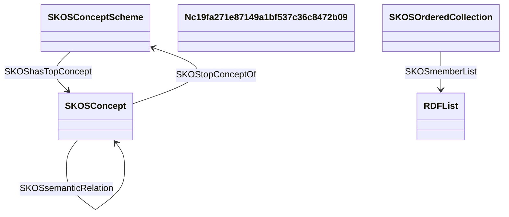

```mermaid
	classDiagram

    
    class SKOSConceptScheme {
    
    }

    class SKOSConcept {
    
    }

    class Nc19fa271e87149a1bf537c36c8472b09 {
    
    }

    class RDFList {
    
    }


SKOSOrderedCollection  --> RDFList   :SKOSmemberList  

SKOSConcept  --> SKOSConcept   :SKOSsemanticRelation  

SKOSConceptScheme  --> SKOSConcept   :SKOShasTopConcept  

SKOSConcept  --> SKOSConceptScheme   :SKOStopConceptOf  

```