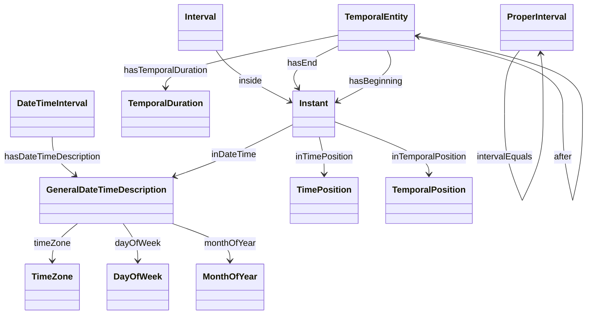

```mermaid
	classDiagram

    
    class ProperInterval {
    
    }

    class TemporalEntity {
    
    }

    class Instant {
    
    }

    class GeneralDateTimeDescription {
    
    }

    class DayOfWeek {
    
    }


ProperInterval  --> ProperInterval   :intervalIn  

ProperInterval  --> ProperInterval   :intervalAfter  

ProperInterval  --> ProperInterval   :intervalFinishes  

TemporalEntity  --> TemporalDuration   :hasTemporalDuration  

TemporalEntity  --> TemporalEntity   :before  

ProperInterval  --> ProperInterval   :intervalStartedBy  

ProperInterval  --> ProperInterval   :intervalMetBy  

ProperInterval  --> ProperInterval   :intervalMeets  

Interval  --> Instant   :inside  

ProperInterval  --> ProperInterval   :intervalDisjoint  

GeneralDateTimeDescription  --> TimeZone   :timeZone  

ProperInterval  --> ProperInterval   :intervalDuring  

ProperInterval  --> ProperInterval   :intervalBefore  

TemporalEntity  --> Instant   :hasEnd  

Instant  --> TimePosition   :inTimePosition  

Instant  --> TemporalPosition   :inTemporalPosition  

DateTimeInterval  --> GeneralDateTimeDescription   :hasDateTimeDescription  

GeneralDateTimeDescription  --> DayOfWeek   :dayOfWeek  

TemporalEntity  --> Instant   :hasBeginning  

ProperInterval  --> ProperInterval   :intervalOverlaps  

ProperInterval  --> ProperInterval   :intervalOverlappedBy  

ProperInterval  --> ProperInterval   :intervalContains  

Instant  --> GeneralDateTimeDescription   :inDateTime  

ProperInterval  --> ProperInterval   :intervalFinishedBy  

ProperInterval  --> ProperInterval   :intervalStarts  

GeneralDateTimeDescription  --> MonthOfYear   :monthOfYear  

TemporalEntity  --> TemporalEntity   :after  

ProperInterval  --> ProperInterval   :intervalEquals  

```