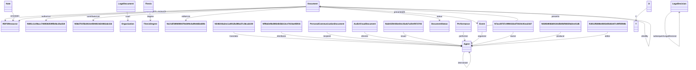

```mermaid
	classDiagram

    
    class Agent {
    
    }

    class Document {
    
    }

    class LegalDecision {
    
    }

    class RDFSResource {
    
    }

    class N691c1c09acc7480582509fb06c2ba518 {
    
    }

    class N56d7fcf5b3814e4594810d24062ab116 {
    
    }

    class Organization {
    
    }

    class ThesisDegree {
    
    }

    class Nc21df3896908478eb99c0a99e8dbdd0b {
    
    }

    class Event {
    
    }


N348244a2ec1a4912bd98a37c36cab100  --> Agent   :translator  

Document  --> Document   :reproducedIn  

Document  --> N691c1c09acc7480582509fb06c2ba518   :authorList  

Nff8a5e9bd08b4b5bb13ce7410ae85916  --> Agent   :distributor  

PersonalCommunicationDocument  --> Agent   :recipient  

AudioVisualDocument  --> Agent   :director  

Document  --> Document   :cites  

Event  --> Document   :presents  

Document  --> DocumentStatus   :status  

LegalDocument  --> Organization   :court  

Nab415fe03be54c1faeb7a1fe4f472745  --> Agent   :issuer  

LegalDecision  --> LegalDecision   :reversedBy  

Document  --> Event   :presentedAt  

Performance  --> Agent   :performer  

Document  --> N56d7fcf5b3814e4594810d24062ab116   :contributorList  

LegalDecision  --> LegalDecision   :affirmedBy  

LegalDecision  --> LegalDecision   :subsequentLegalDecision  

Thesis  --> ThesisDegree   :degree  

Event  --> Agent   :organizer  

Agent  --> Agent   :interviewee  

Document  --> Document   :translationOf  

Document  --> Nc21df3896908478eb99c0a99e8dbdd0b   :editorList  

Document  --> RDFSResource   :transcriptOf  

Agent  --> Agent   :interviewer  

N7acd4757c9994332af7bfc9c91ea3167  --> Agent   :owner  

Note  --> RDFSResource   :annotates  

N028b906b69104d569bf88359a0ee41d6  --> Agent   :producer  

Document  --> Document   :citedBy  

Document  --> RDFSResource   :reviewOf  

N3012f6088e804b40b0de07c09ffdf48b  --> Agent   :editor  

D  --> T   :C  

```