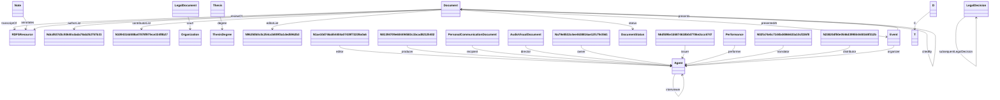

```mermaid
	classDiagram

    
    class Agent {
    
    }

    class Document {
    
    }

    class LegalDecision {
    
    }

    class RDFSResource {
    
    }

    class Ndcd927d3c93640cdada78ab252757b31 {
    
    }

    class N1094314d488a47878f97fece334f8b27 {
    
    }

    class Organization {
    
    }

    class ThesisDegree {
    
    }

    class N96250b0c0c254ccb809f3a1ded5962b3 {
    
    }

    class Event {
    
    }


N1ae10d746a554404a07439f72239a0a6  --> Agent   :editor  

Document  --> Document   :reproducedIn  

Document  --> Ndcd927d3c93640cdada78ab252757b31   :authorList  

N81394709e604494583c1bcad82125402  --> Agent   :producer  

PersonalCommunicationDocument  --> Agent   :recipient  

AudioVisualDocument  --> Agent   :director  

Document  --> Document   :cites  

Event  --> Document   :presents  

Document  --> DocumentStatus   :status  

Na79e8532c4ee4638816ae12fc7fe3561  --> Agent   :owner  

Document  --> N96250b0c0c254ccb809f3a1ded5962b3   :editorList  

LegalDocument  --> Organization   :court  

N6dfd95e1b5874618b0d7706e2ccc6747  --> Agent   :issuer  

LegalDecision  --> LegalDecision   :reversedBy  

Document  --> Event   :presentedAt  

Performance  --> Agent   :performer  

N02fa74e5c7144bd4866633a10cf226f0  --> Agent   :translator  

LegalDecision  --> LegalDecision   :affirmedBy  

LegalDecision  --> LegalDecision   :subsequentLegalDecision  

N23820df50e0546d399554440168f312b  --> Agent   :distributor  

Thesis  --> ThesisDegree   :degree  

Event  --> Agent   :organizer  

Agent  --> Agent   :interviewee  

Document  --> Document   :translationOf  

Document  --> RDFSResource   :transcriptOf  

Agent  --> Agent   :interviewer  

Note  --> RDFSResource   :annotates  

Document  --> N1094314d488a47878f97fece334f8b27   :contributorList  

Document  --> Document   :citedBy  

Document  --> RDFSResource   :reviewOf  

D  --> T   :C  

```