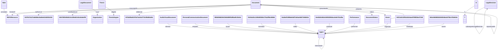

```mermaid
	classDiagram

    
    class Agent {
    
    }

    class Document {
    
    }

    class LegalDecision {
    
    }

    class RDFSResource {
    
    }

    class N379176127a684b6c9a65e615dbfb1032 {
    
    }

    class N0476f0449d414c429e60142c63a0eff8 {
    
    }

    class Organization {
    
    }

    class ThesisDegree {
    
    }

    class N7b2bf6a9197b47aeb1d77dcf8dd5a04c {
    
    }

    class Event {
    
    }


LegalDecision  --> LegalDecision   :affirmedBy  

Document  --> Document   :cites  

Document  --> N0476f0449d414c429e60142c63a0eff8   :contributorList  

LegalDecision  --> LegalDecision   :reversedBy  

LegalDecision  --> LegalDecision   :subsequentLegalDecision  

Document  --> N7b2bf6a9197b47aeb1d77dcf8dd5a04c   :editorList  

Document  --> Document   :translationOf  

Document  --> N379176127a684b6c9a65e615dbfb1032   :authorList  

Note  --> RDFSResource   :annotates  

Document  --> RDFSResource   :reviewOf  

AudioVisualDocument  --> Agent   :director  

Thesis  --> ThesisDegree   :degree  

Agent  --> Agent   :interviewer  

PersonalCommunicationDocument  --> Agent   :recipient  

Nfb8296829ef2460d89f4d9ba8fc35e5c  --> Agent   :issuer  

LegalDocument  --> Organization   :court  

N145a35c1249d405b9c7f4a3ff6c65066  --> Agent   :translator  

Na36ef10996e84df7a84a44657346b53e  --> Agent   :editor  

Ne4b2b4362e394fd290dac4e8e751afba  --> Agent   :producer  

Agent  --> Agent   :interviewee  

Document  --> Document   :citedBy  

Document  --> RDFSResource   :transcriptOf  

Document  --> DocumentStatus   :status  

Document  --> Event   :presentedAt  

Performance  --> Agent   :performer  

Document  --> Document   :reproducedIn  

Event  --> Agent   :organizer  

Event  --> Document   :presents  

N1f11d313f91d4244ae879f8f26e27182  --> Agent   :distributor  

N61e060883b054554beb47f61e7bb543e  --> Agent   :owner  

D  --> T   :C  

```