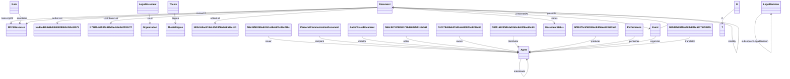

```mermaid
	classDiagram

    
    class Agent {
    
    }

    class Document {
    
    }

    class LegalDecision {
    
    }

    class RDFSResource {
    
    }

    class Nadced204a6b44844828862c053e91575 {
    
    }

    class N728f54e3587d485dbe4c8e0e2f031277 {
    
    }

    class Organization {
    
    }

    class ThesisDegree {
    
    }

    class N83c160ac87da447a93f9edee6527ccc1 {
    
    }

    class Event {
    
    }


Document  --> Document   :reproducedIn  

N5e3df60259ad4151a18eb6f1c85c298c  --> Agent   :issuer  

Document  --> Nadced204a6b44844828862c053e91575   :authorList  

Document  --> N728f54e3587d485dbe4c8e0e2f031277   :contributorList  

PersonalCommunicationDocument  --> Agent   :recipient  

AudioVisualDocument  --> Agent   :director  

Document  --> Document   :cites  

N62c92711f5894171bd6685fa5115a559  --> Agent   :editor  

N10378a98ab374d1abd4082fee8235e0d  --> Agent   :owner  

Event  --> Document   :presents  

Document  --> DocumentStatus   :status  

Document  --> N83c160ac87da447a93f9edee6527ccc1   :editorList  

LegalDocument  --> Organization   :court  

LegalDecision  --> LegalDecision   :reversedBy  

N00516828f6124a53b3cde00fdaed5cd0  --> Agent   :distributor  

Nf4b371c5fd2248ec84f66ae0d3621be1  --> Agent   :producer  

Document  --> Event   :presentedAt  

Performance  --> Agent   :performer  

LegalDecision  --> LegalDecision   :affirmedBy  

LegalDecision  --> LegalDecision   :subsequentLegalDecision  

Thesis  --> ThesisDegree   :degree  

Event  --> Agent   :organizer  

Agent  --> Agent   :interviewee  

Document  --> Document   :translationOf  

Document  --> RDFSResource   :transcriptOf  

Agent  --> Agent   :interviewer  

Note  --> RDFSResource   :annotates  

Document  --> Document   :citedBy  

Document  --> RDFSResource   :reviewOf  

N39d3fe09456e46fb94f9c53775793295  --> Agent   :translator  

D  --> T   :C  

```