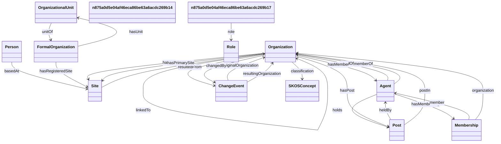

```mermaid
	classDiagram

    
    class Organization {
    
    }

    class Site {
    
    }

    class Agent {
    
    }

    class ChangeEvent {
    
    }

    class Post {
    
    }

    class OrganizationalUnit {
    
    }

    class FormalOrganization {
    
    }

    class SKOSConcept {
    
    }

    class n875a0d5e04af46eca86be63a6acdc269b14 {
    
    }

    class Role {
    
    }


Person  --> Site   :basedAt  

ChangeEvent  --> Organization   :originalOrganization  

FormalOrganization  --> OrganizationalUnit   :hasUnit  

Agent  --> Organization   :headOf  

Organization  --> SKOSConcept   :classification  

Site  --> Organization   :siteOf  

Organization  --> Organization   :subOrganizationOf  

FormalOrganization  --> Site   :hasRegisteredSite  

Organization  --> ChangeEvent   :resultedFrom  

Organization  --> Organization   :hasSubOrganization  

Agent  --> Post   :holds  

Organization  --> Site   :hasSite  

OrganizationalUnit  --> FormalOrganization   :unitOf  

n875a0d5e04af46eca86be63a6acdc269b17  --> Role   :role  

Organization  --> ChangeEvent   :changedBy  

Agent  --> Membership   :hasMembership  

Membership  --> Agent   :member  

Membership  --> Organization   :organization  

Post  --> Agent   :heldBy  

ChangeEvent  --> Organization   :resultingOrganization  

Post  --> Organization   :postIn  

Organization  --> Organization   :transitiveSubOrganizationOf  

Organization  --> Site   :hasPrimarySite  

Agent  --> Organization   :memberOf  

Organization  --> Agent   :hasMember  

Organization  --> Organization   :linkedTo  

Organization  --> Post   :hasPost  

```