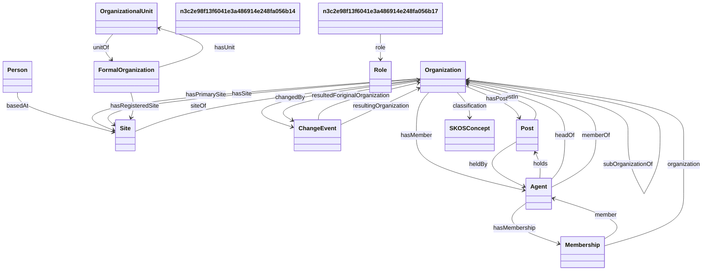

```mermaid
	classDiagram

    
    class Organization {
    
    }

    class Site {
    
    }

    class Agent {
    
    }

    class ChangeEvent {
    
    }

    class Post {
    
    }

    class OrganizationalUnit {
    
    }

    class FormalOrganization {
    
    }

    class SKOSConcept {
    
    }

    class n3c2e98f13f6041e3a486914e248fa056b14 {
    
    }

    class Role {
    
    }


Person  --> Site   :basedAt  

Organization  --> ChangeEvent   :changedBy  

Post  --> Organization   :postIn  

FormalOrganization  --> OrganizationalUnit   :hasUnit  

Organization  --> Post   :hasPost  

Organization  --> Organization   :hasSubOrganization  

Organization  --> Agent   :hasMember  

Organization  --> ChangeEvent   :resultedFrom  

Organization  --> Organization   :linkedTo  

Site  --> Organization   :siteOf  

Organization  --> SKOSConcept   :classification  

ChangeEvent  --> Organization   :originalOrganization  

Membership  --> Agent   :member  

OrganizationalUnit  --> FormalOrganization   :unitOf  

Agent  --> Post   :holds  

Post  --> Agent   :heldBy  

Organization  --> Organization   :transitiveSubOrganizationOf  

Organization  --> Organization   :subOrganizationOf  

Organization  --> Site   :hasPrimarySite  

n3c2e98f13f6041e3a486914e248fa056b17  --> Role   :role  

Membership  --> Organization   :organization  

ChangeEvent  --> Organization   :resultingOrganization  

Agent  --> Organization   :headOf  

Agent  --> Membership   :hasMembership  

Organization  --> Site   :hasSite  

Agent  --> Organization   :memberOf  

FormalOrganization  --> Site   :hasRegisteredSite  

```