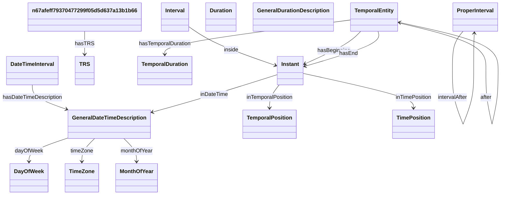

```mermaid
	classDiagram

    
    class ProperInterval {
    
    }

    class TemporalEntity {
    
    }

    class Instant {
    
    }

    class GeneralDateTimeDescription {
    
    }

    class DayOfWeek {
    
    }

    class Duration {
    
    }

    class GeneralDurationDescription {
    
    }

    class TRS {
    
    }

    class TemporalDuration {
    
    }

    class TemporalPosition {
    
    }


ProperInterval  --> ProperInterval   :intervalOverlaps  

ProperInterval  --> ProperInterval   :intervalDuring  

Interval  --> Instant   :inside  

ProperInterval  --> ProperInterval   :intervalStarts  

ProperInterval  --> ProperInterval   :intervalBefore  

GeneralDateTimeDescription  --> DayOfWeek   :dayOfWeek  

TemporalEntity  --> TemporalEntity   :before  

TemporalEntity  --> TemporalEntity   :after  

GeneralDateTimeDescription  --> TimeZone   :timeZone  

GeneralDateTimeDescription  --> MonthOfYear   :monthOfYear  

Instant  --> TimePosition   :inTimePosition  

ProperInterval  --> ProperInterval   :intervalFinishes  

ProperInterval  --> ProperInterval   :intervalMetBy  

Instant  --> TemporalPosition   :inTemporalPosition  

TemporalEntity  --> Instant   :hasBeginning  

TemporalEntity  --> TemporalDuration   :hasTemporalDuration  

DateTimeInterval  --> GeneralDateTimeDescription   :hasDateTimeDescription  

ProperInterval  --> ProperInterval   :intervalDisjoint  

Instant  --> GeneralDateTimeDescription   :inDateTime  

ProperInterval  --> ProperInterval   :intervalFinishedBy  

ProperInterval  --> ProperInterval   :intervalEquals  

n67afeff79370477299f05d5d637a13b1b66  --> TRS   :hasTRS  

TemporalEntity  --> Instant   :hasEnd  

ProperInterval  --> ProperInterval   :intervalMeets  

ProperInterval  --> ProperInterval   :intervalStartedBy  

ProperInterval  --> ProperInterval   :intervalIn  

ProperInterval  --> ProperInterval   :intervalOverlappedBy  

ProperInterval  --> ProperInterval   :intervalContains  

ProperInterval  --> ProperInterval   :intervalAfter  

```