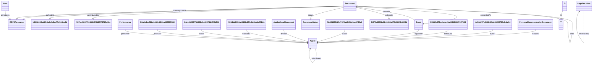

```mermaid
	classDiagram

    
    class Agent {
    
    }

    class Document {
    
    }

    class LegalDecision {
    
    }

    class RDFSResource {
    
    }

    class N2b3620fbaf694fe0afe2ca77d9e5ea5b {
    
    }


Document  --> Document   :translationOf  

Document  --> N67fc4fb4079348dd8f6d83f78715e12e   :contributorList  

PersonalCommunicationDocument  --> Agent   :recipient  

Nc32a787c6d40425a969290793db4fe94  --> Agent   :owner  

Agent  --> Agent   :interviewee  

N5342a077ddfa4ed1a44642b207657663  --> Agent   :distributor  

Event  --> Document   :presents  

Agent  --> Agent   :interviewer  

Event  --> Agent   :organizer  

Nc686078425c7472ab6b92e9ae3ff23a0  --> Agent   :issuer  

Document  --> RDFSResource   :reviewOf  

Document  --> DocumentStatus   :status  

AudioVisualDocument  --> Agent   :director  

Document  --> N2b3620fbaf694fe0afe2ca77d9e5ea5b   :authorList  

Document  --> N572a03802dfb41208a276b0065b9809d   :editorList  

N29dbd88b9a19481e853cb04ab1c35b2a  --> Agent   :translator  

Document  --> RDFSResource   :transcriptOf  

Note  --> RDFSResource   :annotates  

N4c131223f761402dbc22274d45f0b511  --> Agent   :editor  

N3a3a5cc588d4438c9f89ea966593300f  --> Agent   :producer  

LegalDecision  --> LegalDecision   :subsequentLegalDecision  

Document  --> Document   :reproducedIn  

LegalDecision  --> LegalDecision   :affirmedBy  

Document  --> Document   :citedBy  

Document  --> Document   :cites  

LegalDecision  --> LegalDecision   :reversedBy  

Document  --> Event   :presentedAt  

Performance  --> Agent   :performer  

D  --> T   :C  

```