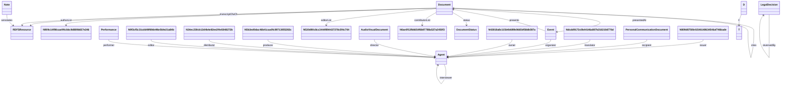

```mermaid
	classDiagram

    
    class Agent {
    
    }

    class Document {
    
    }

    class LegalDecision {
    
    }

    class RDFSResource {
    
    }

    class N909c14f98caa4f4cbbc9d889b827e246 {
    
    }


Document  --> Document   :translationOf  

N809d8750b41546148634546af746bade  --> Agent   :issuer  

PersonalCommunicationDocument  --> Agent   :recipient  

Agent  --> Agent   :interviewee  

Event  --> Document   :presents  

Ndcdd9173c0b44146a807b216310d776d  --> Agent   :translator  

Agent  --> Agent   :interviewer  

Document  --> N530d90c8cc3444f894437378c5f4c704   :editorList  

Event  --> Agent   :organizer  

N43018a8c115b4b689b0665bf58db597a  --> Agent   :owner  

Document  --> RDFSResource   :reviewOf  

Document  --> N6ae0f13fb6654f6b97788a527a2450f3   :contributorList  

Document  --> N909c14f98caa4f4cbbc9d889b827e246   :authorList  

Document  --> DocumentStatus   :status  

AudioVisualDocument  --> Agent   :director  

N5b3ed0dac46b41caa0fc89713055282c  --> Agent   :producer  

Document  --> RDFSResource   :transcriptOf  

Note  --> RDFSResource   :annotates  

LegalDecision  --> LegalDecision   :subsequentLegalDecision  

N34ec230cb12d4b4e82ee2f4e5048272b  --> Agent   :distributor  

Document  --> Document   :reproducedIn  

LegalDecision  --> LegalDecision   :affirmedBy  

Document  --> Document   :citedBy  

Document  --> Document   :cites  

N9f3cf5c31cdd49f69de96e564e21a84b  --> Agent   :editor  

LegalDecision  --> LegalDecision   :reversedBy  

Document  --> Event   :presentedAt  

Performance  --> Agent   :performer  

D  --> T   :C  

```