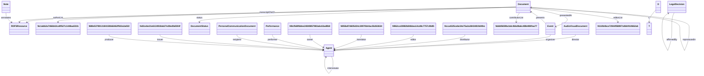

```mermaid
	classDiagram

    
    class Agent {
    
    }

    class Document {
    
    }

    class LegalDecision {
    
    }

    class RDFSResource {
    
    }

    class Nc1abb2a7466b42ce8f527c1448aa531b {
    
    }


Document  --> Nc1abb2a7466b42ce8f527c1448aa531b   :authorList  

LegalDecision  --> LegalDecision   :reversedBy  

AudioVisualDocument  --> Agent   :director  

Document  --> Document   :cites  

Document  --> RDFSResource   :reviewOf  

Document  --> Document   :translationOf  

Document  --> Event   :presentedAt  

Event  --> Agent   :organizer  

Document  --> DocumentStatus   :status  

Document  --> Document   :citedBy  

Ncca4325ce6e34e75a2a38434819d4fec  --> Agent   :distributor  

Document  --> Document   :reproducedIn  

Agent  --> Agent   :interviewer  

N962ccd3982b84bbea14cd8c7757c9b85  --> Agent   :editor  

N058a97d605d34c30970b44ac5b263634  --> Agent   :translator  

N9cfb69fddee24849857983a6c63ad8b0  --> Agent   :owner  

Performance  --> Agent   :performer  

PersonalCommunicationDocument  --> Agent   :recipient  

LegalDecision  --> LegalDecision   :subsequentLegalDecision  

Agent  --> Agent   :interviewee  

Document  --> RDFSResource   :transcriptOf  

Note  --> RDFSResource   :annotates  

Document  --> Nddd5659bcbdc4bbd8a6c488e980faa77   :contributorList  

Event  --> Document   :presents  

Nd2cebe31e6134918ab27e28edfa8304f  --> Agent   :issuer  

N88e5378013184150b66462f922a3a022  --> Agent   :producer  

Document  --> N110b4bce72944f588971dbbf410662ab   :editorList  

LegalDecision  --> LegalDecision   :affirmedBy  

D  --> T   :C  

```