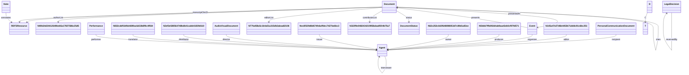

```mermaid
	classDiagram

    
    class Agent {
    
    }

    class Document {
    
    }

    class LegalDecision {
    
    }

    class RDFSResource {
    
    }

    class N49b34d24412649beb5a17927586c25d5 {
    
    }


Document  --> Document   :translationOf  

PersonalCommunicationDocument  --> Agent   :recipient  

Agent  --> Agent   :interviewee  

Event  --> Document   :presents  

N145a47e27d6b4453b71dddc91c6bc251  --> Agent   :editor  

Agent  --> Agent   :interviewer  

Event  --> Agent   :organizer  

N5bbb7ffb092d4ab9aae5eb0cf97fd571  --> Agent   :producer  

Document  --> N77fa458a5c1b4a51a315db3abaa82106   :editorList  

Document  --> RDFSResource   :reviewOf  

N63c252c642f648898053d7c89d1a83ce  --> Agent   :owner  

Document  --> N322f9e0482434219958abadf204b75a7   :contributorList  

Document  --> DocumentStatus   :status  

Nec8f329d8d674fe6affdec7427be6bc3  --> Agent   :issuer  

AudioVisualDocument  --> Agent   :director  

Document  --> RDFSResource   :transcriptOf  

Note  --> RDFSResource   :annotates  

N2ef3e580564748bdb41cabb41839d110  --> Agent   :distributor  

LegalDecision  --> LegalDecision   :subsequentLegalDecision  

Document  --> Document   :reproducedIn  

LegalDecision  --> LegalDecision   :affirmedBy  

Document  --> Document   :citedBy  

Document  --> Document   :cites  

Document  --> N49b34d24412649beb5a17927586c25d5   :authorList  

N832cddf1bfbb4699ac6d33b8f9c4f934  --> Agent   :translator  

LegalDecision  --> LegalDecision   :reversedBy  

Document  --> Event   :presentedAt  

Performance  --> Agent   :performer  

D  --> T   :C  

```