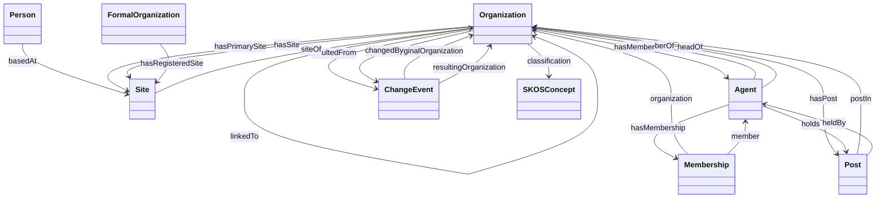

```mermaid
	classDiagram

    
    class Organization {
    
    }

    class Site {
    
    }

    class Agent {
    
    }

    class ChangeEvent {
    
    }

    class Post {
    
    }


Person  --> Site   :basedAt  

Organization  --> Site   :hasPrimarySite  

Organization  --> ChangeEvent   :resultedFrom  

Post  --> Organization   :postIn  

Organization  --> SKOSConcept   :classification  

ChangeEvent  --> Organization   :originalOrganization  

Organization  --> Site   :hasSite  

Organization  --> Organization   :hasSubOrganization  

FormalOrganization  --> Site   :hasRegisteredSite  

Organization  --> Organization   :subOrganizationOf  

Organization  --> ChangeEvent   :changedBy  

Agent  --> Organization   :memberOf  

Membership  --> Organization   :organization  

Organization  --> Organization   :transitiveSubOrganizationOf  

Site  --> Organization   :siteOf  

Organization  --> Agent   :hasMember  

Organization  --> Organization   :linkedTo  

Organization  --> Post   :hasPost  

ChangeEvent  --> Organization   :resultingOrganization  

Agent  --> Organization   :headOf  

Membership  --> Agent   :member  

Post  --> Agent   :heldBy  

Agent  --> Membership   :hasMembership  

Agent  --> Post   :holds  

```