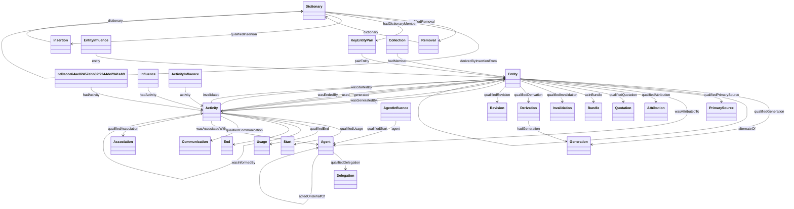

```mermaid
	classDiagram

    
    class Entity {
    
    }

    class Activity {
    
    }

    class Agent {
    
    }

    class Dictionary {
    
    }

    class Generation {
    
    }


nd9acce64ae82457ebb82f2244de2941ab9  --> Activity   :hadActivity  

Entity  --> Generation   :qualifiedGeneration  

Activity  --> Entity   :generated  

Activity  --> Start   :qualifiedStart  

Activity  --> Usage   :qualifiedUsage  

Dictionary  --> Removal   :qualifiedRemoval  

Dictionary  --> Dictionary   :derivedByRemovalFrom  

Entity  --> Entity   :hadPrimarySource  

Agent  --> Delegation   :qualifiedDelegation  

Entity  --> Entity   :wasRevisionOf  

AgentInfluence  --> Agent   :agent  

Entity  --> PrimarySource   :qualifiedPrimarySource  

Activity  --> Entity   :used  

Dictionary  --> KeyEntityPair   :hadDictionaryMember  

Entity  --> Entity   :wasDerivedFrom  

EntityInfluence  --> Entity   :entity  

Entity  --> Entity   :specializationOf  

Removal  --> Dictionary   :dictionary  

Entity  --> Agent   :wasAttributedTo  

Entity  --> Attribution   :qualifiedAttribution  

Entity  --> Entity   :mentionOf  

Activity  --> Activity   :wasInformedBy  

Activity  --> End   :qualifiedEnd  

Insertion  --> Dictionary   :dictionary  

Entity  --> Quotation   :qualifiedQuotation  

Activity  --> Communication   :qualifiedCommunication  

Entity  --> Bundle   :asInBundle  

Entity  --> Invalidation   :qualifiedInvalidation  

Dictionary  --> Dictionary   :derivedByInsertionFrom  

Entity  --> Entity   :wasQuotedFrom  

Agent  --> Agent   :actedOnBehalfOf  

Entity  --> Entity   :alternateOf  

Entity  --> Derivation   :qualifiedDerivation  

Activity  --> Entity   :wasEndedBy  

Activity  --> Agent   :wasAssociatedWith  

Derivation  --> Generation   :hadGeneration  

KeyEntityPair  --> Entity   :pairEntity  

Entity  --> Revision   :qualifiedRevision  

Entity  --> Activity   :wasInvalidatedBy  

Collection  --> Entity   :hadMember  

Activity  --> Entity   :wasStartedBy  

Influence  --> Activity   :hadActivity  

ActivityInfluence  --> Activity   :activity  

Activity  --> Association   :qualifiedAssociation  

Dictionary  --> Insertion   :qualifiedInsertion  

Entity  --> Activity   :wasGeneratedBy  

Activity  --> Entity   :invalidated  

```