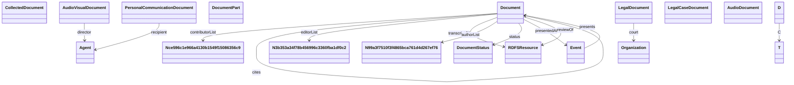

```mermaid
	classDiagram

    
    class CollectedDocument {
    
    }

    class AudioVisualDocument {
    
    }

    class PersonalCommunicationDocument {
    
    }

    class DocumentPart {
    
    }

    class Document {
    
    }

    class LegalDocument {
    
    }

    class LegalCaseDocument {
    
    }

    class AudioDocument {
    
    }

    class DocumentStatus {
    
    }


AudioVisualDocument  --> Agent   :director  

Document  --> Nce596c1e966a4130b1549f15086356c9   :contributorList  

Event  --> Document   :presents  

Document  --> Document   :translationOf  

Document  --> N3b353a34f78b456996c3360fba1df0c2   :editorList  

Document  --> Document   :citedBy  

Document  --> RDFSResource   :transcriptOf  

Document  --> Document   :reproducedIn  

Document  --> N99a3f7510f3f4865bca761d4d267ef76   :authorList  

LegalDocument  --> Organization   :court  

D  --> T   :C  

PersonalCommunicationDocument  --> Agent   :recipient  

Document  --> Document   :cites  

Document  --> DocumentStatus   :status  

Document  --> Event   :presentedAt  

Document  --> RDFSResource   :reviewOf  

```